# Guide for install WorMe Length determination

WorMe works in Windows OS. On the next, is described different ways to run WorMe and the installation guide:

- As an [**standalone aplication**](#installation-of-worme-standalone-software). MATALB license is not required. It installs automatically WorMe and MATLAB Runtime 9.11 as local softwares.
- As a [**runtime-dependent application**](#installation-of-worme-runtime-dependent-application).  MATLAB license is not required. It installs the MATLAB Runtime 9.11 and executes WorMe as a local runtime-dependent application. 
- [**Running the code from MATLAB Desktop**](#runnign-worme-from-matlab-desktop). License is required. MATLAB version 9.11 (2021b) or higher.

For to see the updated versions of the WorMe program, see: [**latest releases**](https://github.com/group-nn-at-icmab-csic/WorMe/releases/latest).

## Installation of WorMe standalone software

<a href="https://raw.githubusercontent.com/group-nn-at-icmab-csic/WorMe/main/Installation/Windows/Installer/WorMe_v2_18_Win_inst.exe" style="font-size:18px; font-weight:bold;">
 <b>WorMe installer</b>
</a>

The next steps describes the installation of WorMe as a local software. This is a easy installation process and doesn't need MATLAB license. WorMe and MATLAB Runtime is going to be installed in Windows OS.

### Installation guide
Download and install the [**executable installation file**](https://raw.githubusercontent.com/group-nn-at-icmab-csic/WorMe/main/Installation/Windows/Installer/WorMe_v2_18_Win_inst.exe). 

 
↓
 
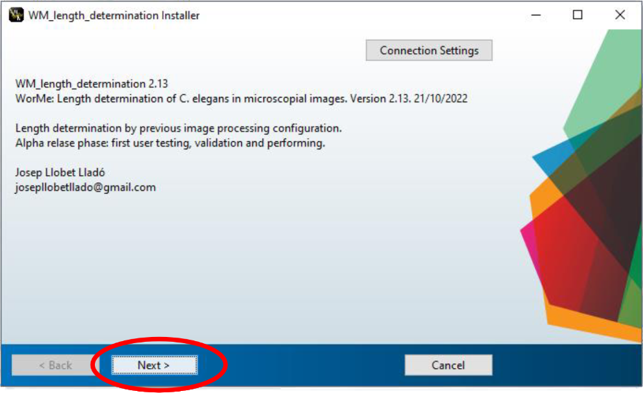

↓
 
Describe the installation folder:
 
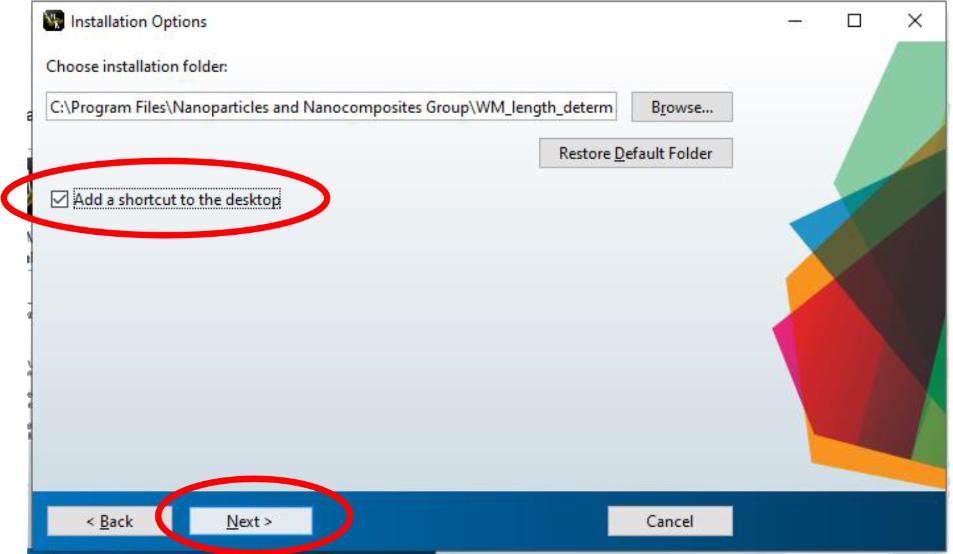
 
Note: is recommended to add a shortcut to the desktop.

↓
 
MATLAB Runtime installation:
 
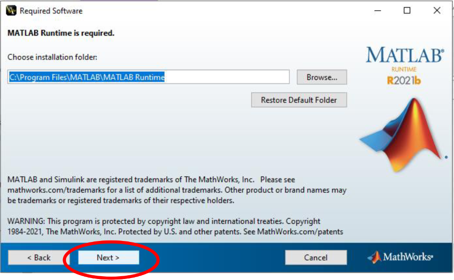

 

Note: MATLAB Runtime is the software which allow to execute the WorMe program. It is not the main MATLAB software, and you will not need a MATLAB license. MATLAB Runtime is just a software that allow to execute the MATLAB compiled programs, like the WorMe program.

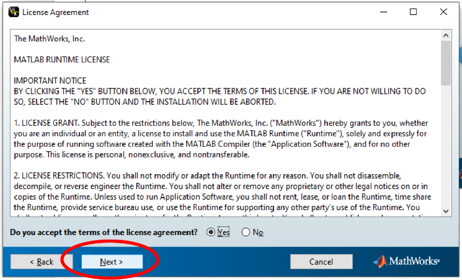
 
↓

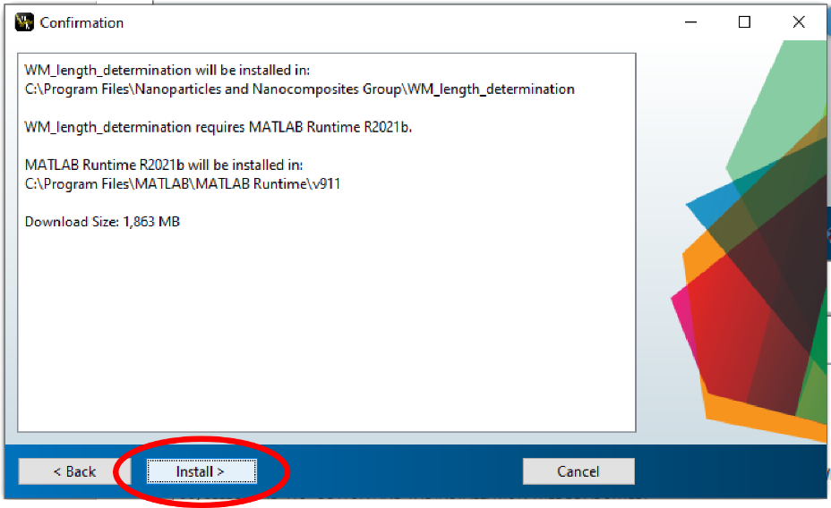
 
↓

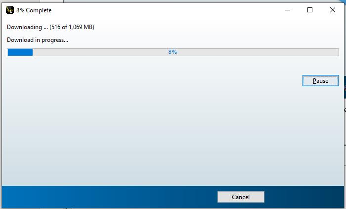
 
↓

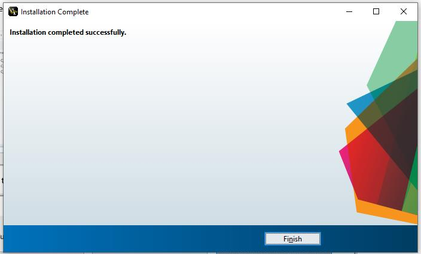
 

Now you have WorMe Length determination installed in your computer. It is going to run by MATLAB Runtime.

For uninstall the program, you just need to go to 'Add or remove programs' of Windows.

 
 
 
 

## Installation of WorMe runtime-dependent application

<a href="https://raw.githubusercontent.com/group-nn-at-icmab-csic/WorMe/main/Installation/Windows/Installer_local/WorMe_v2_18_Win_rundep_inst.zip" style="font-size:18px; font-weight:bold;">
 <b>WorMe runtime-dependent application</b>
</a>

 

The user can install MATLAB Runtime in the computer and run WorMe just as a runtime-dependent application. This allows to install WorMe **without internet connexion**. In Windows, it just works in 64 bits.  

### Installation guide

First of all the user have to go to [**MATLAB Runtime versions website**](https://es.mathworks.com/products/compiler/matlab-runtime.html), from MATLAB Compiler, and download the [**MATLAB Runtime version R2021b (9.11)**](https://ssd.mathworks.com/supportfiles/downloads/R2021b/Release/7/deployment_files/installer/complete/win64/MATLAB_Runtime_R2021b_Update_7_win64.zip).  

In the WorMe standalone application, the MATLAB Runtime R2021b is automatically downloaded and installed.  

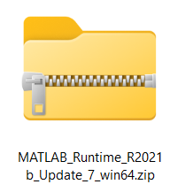
 

On the next, we uncompress the folder, and install MATLAB Runtime by clicking in the standalone executable **setup.exe**.

And we can start with the installation:

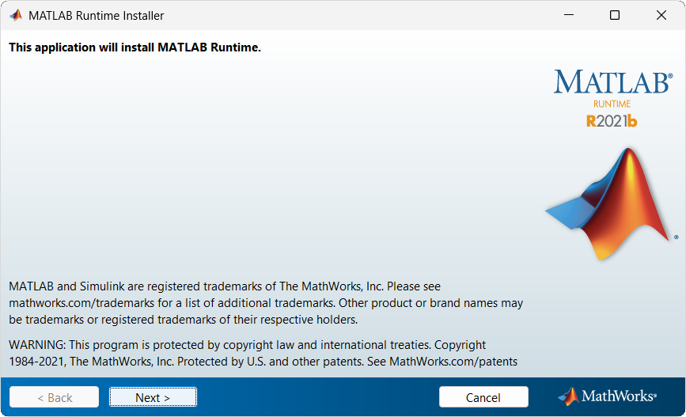
 
↓

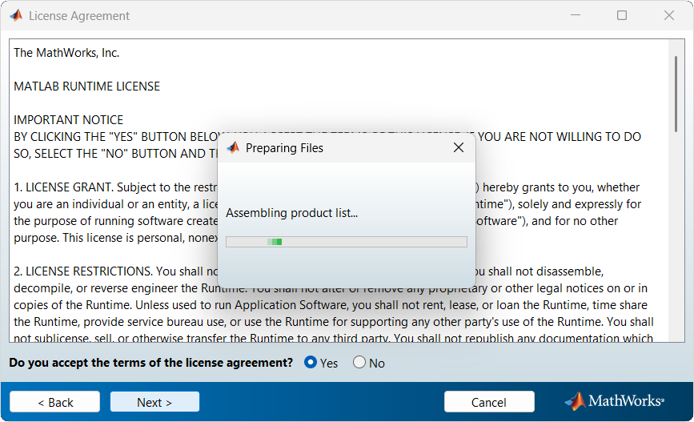
 
↓

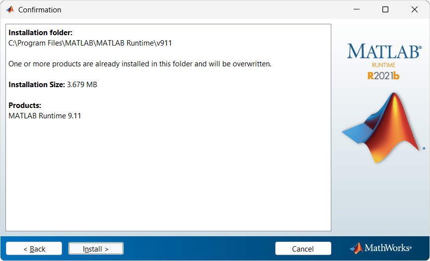
 
↓

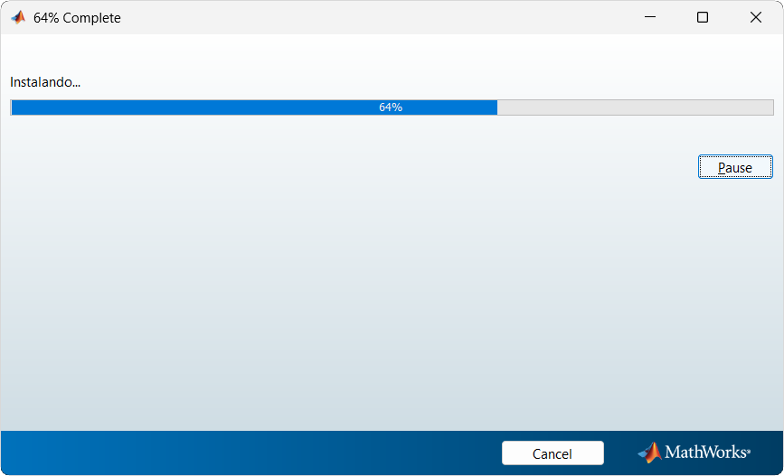
 

 

Once Runtime is installed, you can download the [**WorMe runtime-dependent file**](https://raw.githubusercontent.com/group-nn-at-icmab-csic/WorMe/main/Installation/Windows/Installer_local/WorMe_v2_18_Win_rundep_inst.zip), which is the one useful for the WorMe execution.  

Then, we can execute WorMe without installation by the executable file:

↓
 

Note that this process doesn't need internet connexion nor the WorMe installation, just MATLAB Runtime installation.

This kind of installation may be slightly more slow than the use of WorMe as a standalone application.

## Runnign WorMe from MATLAB Desktop

<a href="https://github.com/group-nn-at-icmab-csic/WorMe/archive/refs/heads/main.zip" style="font-size:18px; font-weight:bold;">
 <b>WorMe source code</b>
</a>

An easy way to execute WorMe is to execute it from MATLAB Desktop. **This process of execution require MATLAB license**, though.  
For to execute the code of WorMe, we need at least a MATLAB Desktop 2021b or greater license, and the license of a few toolboxes. 

The program toolboxes required for the execution are:
- [Computer Vision Toolbox](https://es.mathworks.com/products/computer-vision.html)
- [Image Processing Toolbox](https://es.mathworks.com/products/image-processing.html)
- [Image Acquisition Toolbox](https://es.mathworks.com/products/image-acquisition.html)
- [Statistics and Machine Learning Toolbox](https://es.mathworks.com/products/statistics.html)  

See: [How to add Add Ons in MATLAB](https://es.mathworks.com/help/matlab/matlab_env/get-add-ons.html)

### Code execution guide

We are going to need the WorMe recent code. This is on the Source code of the [**latest releases**](https://github.com/group-nn-at-icmab-csic/WorMe/releases/latest).  

 

The program can simply be used by running the main script [`WM_length_determination.m`](https://github.com/group-nn-at-icmab-csic/WorMe/blob/main/source/WM_length_determination.m) frmo the *source* folder.

This is going to allow the user to see in deep the code of WorMe.

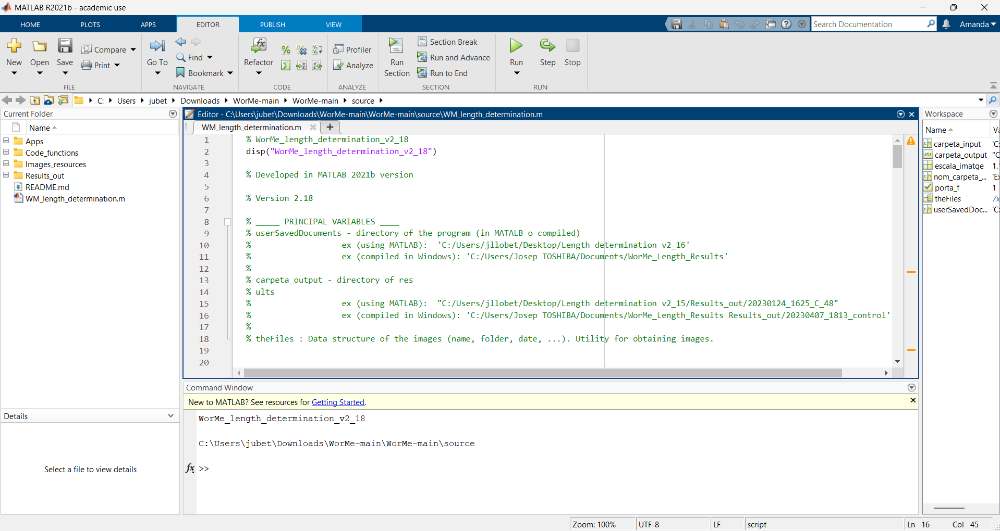
