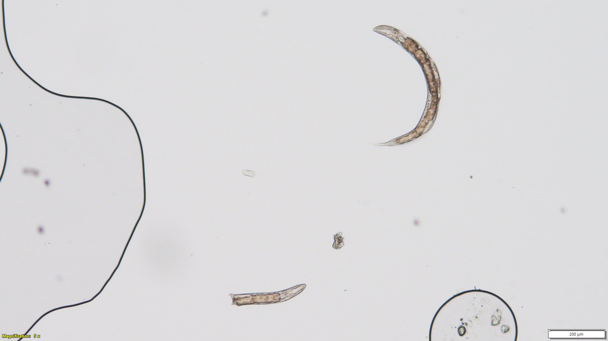
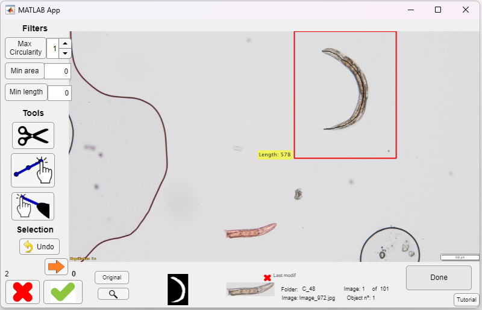

# WorMe
WorMe is a Software for *Caenorhabditis elegans* length determination.

*Developed by Josep Llobet, documentation helped by Núria Garriga at Institut de Ciencia de Materials de Barcelona (ICMAB-CSIC)*

[Group of Nanoparticles and Nanocomposites - ICMAB-CSIC](https://nn.icmab.es/)

For detailed documentation please check out the [User Manual](documentation/worme_manual.md).

## Citation

Please cite our publication describing this software as follows:

----------------------------------------------------------------

## Contributing, Reporting Issues and Support

For bug reports and feature requests, please open an issue on the [GitHub issue tracker](https://github.com/group-nn-at-icmab-csic/WorMe/issues).

For code contributions, please fork the `main` branch, push your changes to your fork and create a pull request.

Please feel free to create an issue if you have any questions or comments. Developers can be contacted at alaromaine@icmab.es (Anna Laromaine).

----------------------------------------------------------------
## Files

* LICENSE: license file, please read.

* /Length_determination/: Folder containing the source code for the WorMe length determination software

* /documentation/: Folder containing the User Manual

* /paper/: Folder containing the paper submitted to JOSS journal

* /examples/: Folder containing example images for length determination

-----------------------------------------

## Installation

WorMe is a MATLAB application for Windows OS. It **does not require a MATLAB licence**. 
- Install as local software from the [executable file](https://github.com/group-nn-at-icmab-csic/WorMe/releases) (.exe)
- Execute [the source code](https://github.com/group-nn-at-icmab-csic/WorMe/releases), `WM_length_determination.m`, from the MATLAB Desktop environment software (version >2021b). (This requires a MATLAB licence).

-------------------------------------------
## Fast Tutorial

There are five steps to use WorMe. 

1. **Image selection**: Select the images to analyse. We will use this image as an example.

 

> [!IMPORTANT]
> Sometimes, an "Invalid or deleted object" error will appear due to exiting the program before going through all the steps. If the error persists when starting the program again, the easiest solution is to delete the `Documents/WorMe_Length_Results` folder.

2. **Scale setting**: Set the measuring scale by selecting the scale bar. With "Select Automatically" the user must double click the scale bar and then input the displayed length number. In this example, it is 200.

3. **Image processing**: Configure the image modifications. Select from the Saved options in Processings the one that shows the worms the best. In this case, we used `Modif_Example_4.txt`. Then, press Analyse.

 

4. **Worm selection**: Select the worm objects manually. If the marked object is a worm, press the green checkmark. If it is not, the red cross. The Tools can modify the objects: the Scissors cut the current object in two, the New Object allows the user to trace a new object, and the Extend Object allows the user to lengthen the current object. Then, press Done.

 

5. **Results**: Press the export button to save the data. Select the "Export manual error corrected data" if the data requires comparison with other manual methods of measurement such as ImageJ.

For a detailed tutorial please check out the [Use of the program](documentation/worme_manual.md#use-of-the-program) section in the User Manual.

-------------------------------------------

