# User Manual - WorMe: *Caenorhabditis elegans* length determination

## Table of Contents

[Introduction](#introduction)  
[Software description, use and features](#software-description-use-and-features)  
[Installation](#installation)  
[Use of the program](#use-of-the-program)   
[Example of usage](#example-of-usage)  
[Software Methodology](#software-methodology)  
[Comparison to ImageJ and WorMachine](#comparison-to-imagej-and-wormachine)  

 

## Introduction

*Caenorhabditis elegans* is a widely used animal model for biomedical research. The length of the nematode is a quantifiable parameter to assess its development. Currently, there are many tools that automatize this process. However, most of the available tools are designed for images from stereomicroscopes, and none were found that worked reliably for compound microscopy images. 

Here we present WorMe, a *Caenorhabditis elegans* length determination software. WorMe is a MATLAB Runtime application that automatizes the length measurements from compound microscopy images. It is open-source and user-friendly, since it works from a graphical user interface. WorMe is also versatile, because it has a wide range of settings to process many kinds of images, and it ensures data reliability since the user selects the worms to be analysed in a computationally optimized process.

The program accepts multiple images as input, which can then be analysed collectively. Furthermore, the user can discard wrongly-detected objects, separate joined worms, correct erroneous measurements and manually add new worms. Then, the results are presented in a spreadsheet file, with each measurement linked to their image. 

## Software description, use and features
### Brief description of the program 

WorMe is an open-source application implemented in *MATLAB version 9.11 (R2021b)* and deployed as an executable using MATLAB Runtime, so it can be installed and run without a licence. It provides automatic detection and measurement of the length of *C. elegans* from microscopy images. It consists of a linear set of pannels that correspond to image processing, worm selection and results.  

WorMe takes the selected images and processes them until it gets individual worms as binary objects, which are skeletonized. Afterwards, the user selects which objects are worms, and the program measures the length of the skeletonization, which corresponds to the length of the worm. This manual selection ensures the quality and reliability of the data, as the user can see what is being measured.

Then, the program presents the length measurements in a spreadsheet. In this step, the program can account for manual error, and it can transform the results into values that would be equivalent to those obtained from manual measurements in programs such as FIJI ImageJ.

Furthermore, the program also provides graphic data, such as binary images, indexed images or PascalVOC data, which would be useful for training Deep Learning models. 

A tutorial can be found in [Use of the program](#use-of-the-program), and an explanation of the used functions, error correction, and optimization can be found in [Software Methodology](#software-methodology).

 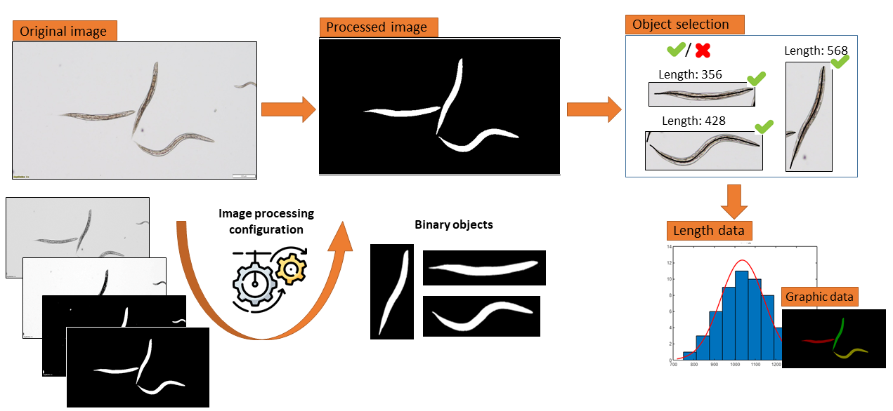  

_Figure 1: Use of the program_

## Installation

WorMe is a MATLAB based software that **does not require a MATLAB licence**. It can be easily installed and executed in one of these two options:  
- Install as local software from the [executable file](https://github.com/group-nn-at-icmab-csic/WorMe/releases) (.exe). This does not require a MATLAB licence, because the program is compiled.
- Execute [the source code](https://github.com/group-nn-at-icmab-csic/WorMe/releases) from the MATLAB Desktop environment software (version >2021b). This requires a MATLAB licence but it has a slightly faster execution time.

The program requires at least 4GB of available disk space, as well as a Windows Operating System. 

### Installation and use from the executable (.exe)

WorMe Length determination can be **easily installed from the [executable file](https://github.com/group-nn-at-icmab-csic/WorMe/releases)** as a local software in Windows. **It does not require a MATLAB licence**.  
The step-by-step installation will automatically download and install MATLAB Runtime R2021b (9.11) and WorMe Length determination as system software. [MATLAB Runtime](https://mathworks.com/products/compiler/matlab-runtime.html) is a collection of the libraries required to run MATLAB aplications, in this case WorMe Length determination.

  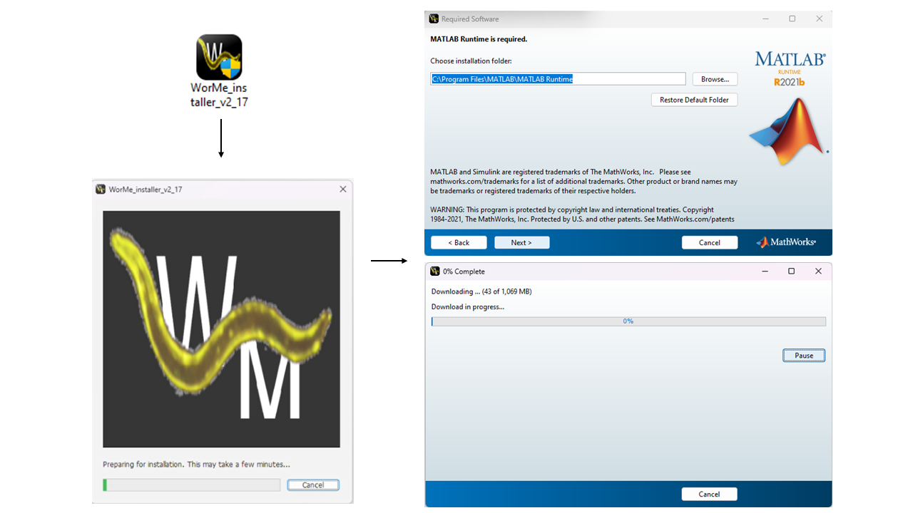
   
  <em>Figure 2: WorMe installer that triggers the installation of MATLAB runtime R2021b</em>

 

### Installation and use from the source code 

The program can also be used by by running the main script [`WM_length_determination.m`](https://github.com/group-nn-at-icmab-csic/WorMe/blob/main/Length_determination/WM_length_determination.m) in MATLAB version R2021b or greater. However, a MATLAB licence is required.  

In this case, the program uses a few toolboxes which are needed for its execution (See: [How to add Add Ons in MATLAB](https://es.mathworks.com/help/matlab/matlab_env/get-add-ons.html)):
- [Computer Vision Toolbox](https://es.mathworks.com/products/computer-vision.html)
- [Image Processing Toolbox](https://es.mathworks.com/products/image-processing.html)
- [Image Acquisition Toolbox](https://es.mathworks.com/products/image-acquisition.html)
- [Statistics and Machine Learning Toolbox](https://es.mathworks.com/products/statistics.html)

The use of the program from the MATLAB Desktop environment software is slightly faster, but the local-installed program is also optimal.

## Use of the program

The use of WorMe is based in five continuous steps:  

→ [Image selection](#image-selection): Select the images to analyse. 
→ [Scale setting](#scale-setting): Set the measuring scale. 
→ [Image processing](#image-processing-panel): Configure the image modification parameters.  
→ [Worm selection](#selection-panel): Select worm objects manually. 
→ [Results](#results-panel): Read and download the results (data and image objects).  

For a fast tutorial, please refer to the repository's [README file](../README.md). For a video tutorial, please proceed to [Example of usage](#example-of-usage).

### Image selection

The program is designed for compound microscopy images with standard proportions, but it can operate with different resolutions and different kinds of microscope images. To change the selected images, the program must be restarted.

> [!IMPORTANT]
> Sometimes, an "Invalid or deleted object" error will appear due to exiting the program before going through all the steps. If the error persists when starting the program again, the easiest solution is to delete the `Documents/WorMe_Length_Results` folder.

#### Image formats
WorMe can operate with a wide range of image formats, including RGB and grayscale images.

Compatible image types are: `.jpg`, `.png`, `.jpeg`, `.tif`, `.tiff`, `.jfif` and `.bmp`.

Non-compatible image types are: `.gif` and `.webp`.

Nevertheless, WorMe is designed for single-layer images. Therefore, it is not compatible with multi-layer or multi-page optical microscopy `.tiff` images. 

#### Image resolution
The selected images can have any resolution, and it is not necessary for it to be uniform between them. 

However, the use of large resolution microscopy images (over 25000 x 25000 px) is possible but not recommended as it would lead to long waiting times due to the logistics of the image processing. Therefore, we recommend lowering the image resolution before measuring worm length.

#### Desired image quality
The program can adapt to any image quality. Even so, it works best with images that are clear, with regular brightness and contrast, without dirt, and with separate worms that are not touching, coiled or tangled.

Examples of desirable and undesirable images can be found below, in Tables 1 and 2, respectively. Of course, as long as the worms in undesirable images are recognizable by the naked eye, they can still be measured manually within WorMe.

In the experimental design, one may consider using cleaning methods of the final plate before image adquisition, which would improve the image analysis step.  

<table>
  <tr>
    <td>a)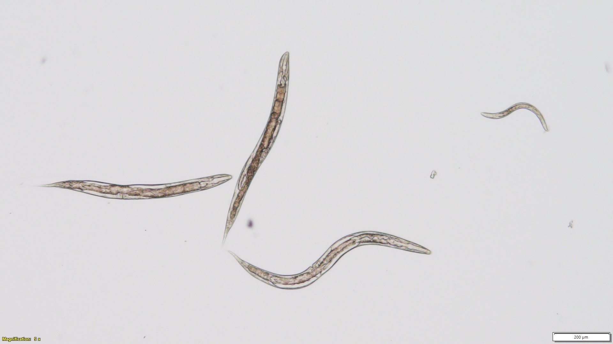</td>
    <td>b)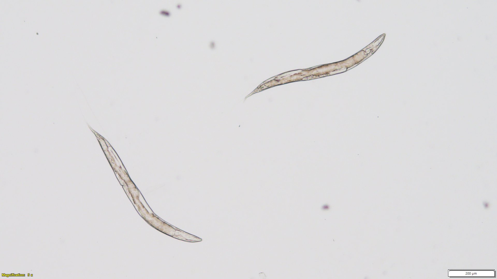</td>
    <td>c)</td>
  </tr>
  <tr>
    <td>d)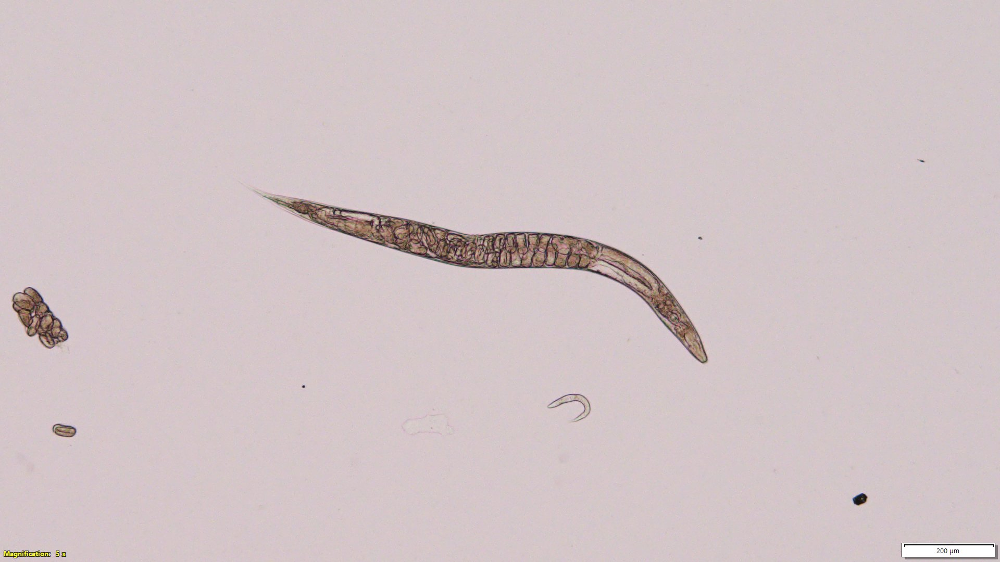</td>
    <td>e)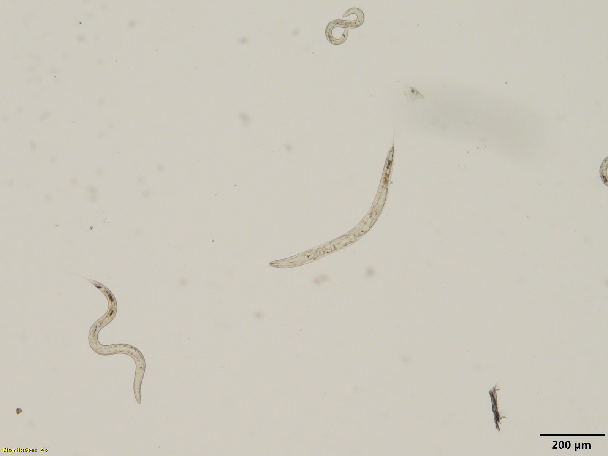</td>
    <td>f)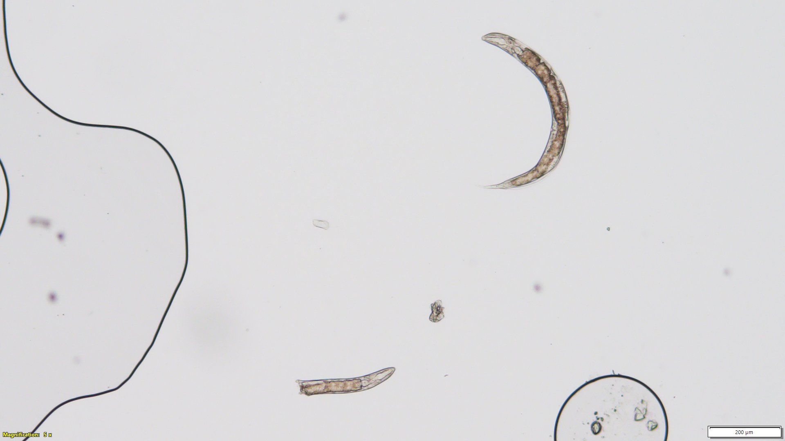</td>
  </tr>
</table>

_Table 1: Examples of desirable images. The background is bright, clean and with regular contrast, and the worms are not coiled or touching. The exceptions are e) where a worm is coiled at the top, and f) where there are some bubbles, but as they are far from the other worms, they do not impede analysis._

<table>
  <tr>
    <td>a)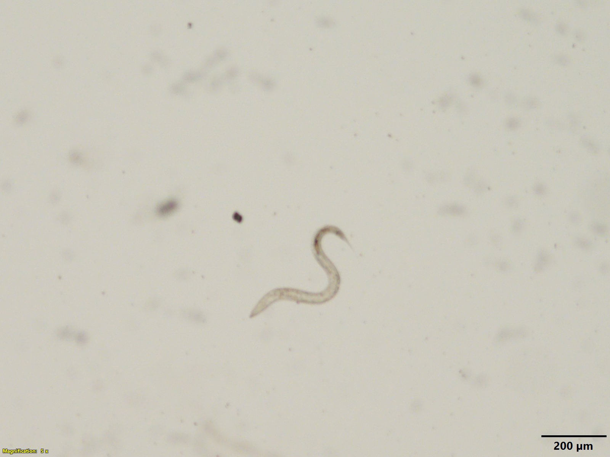</td>
    <td>b)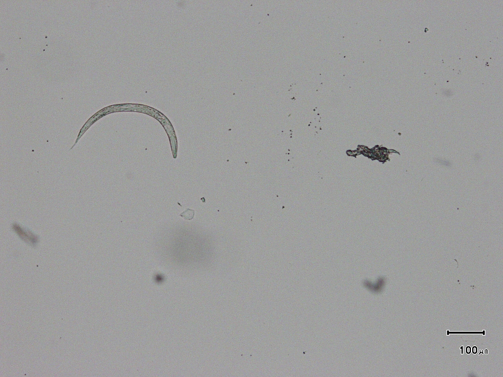</td>
    <td>c)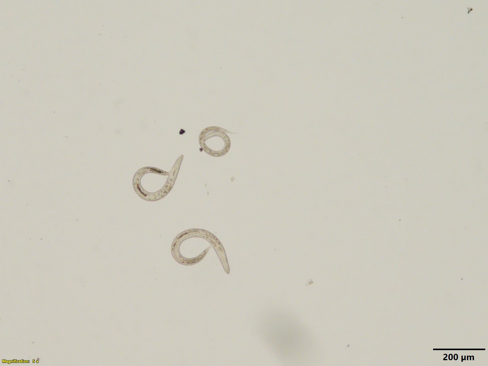</td>
  </tr>
  <tr>
    <td>d)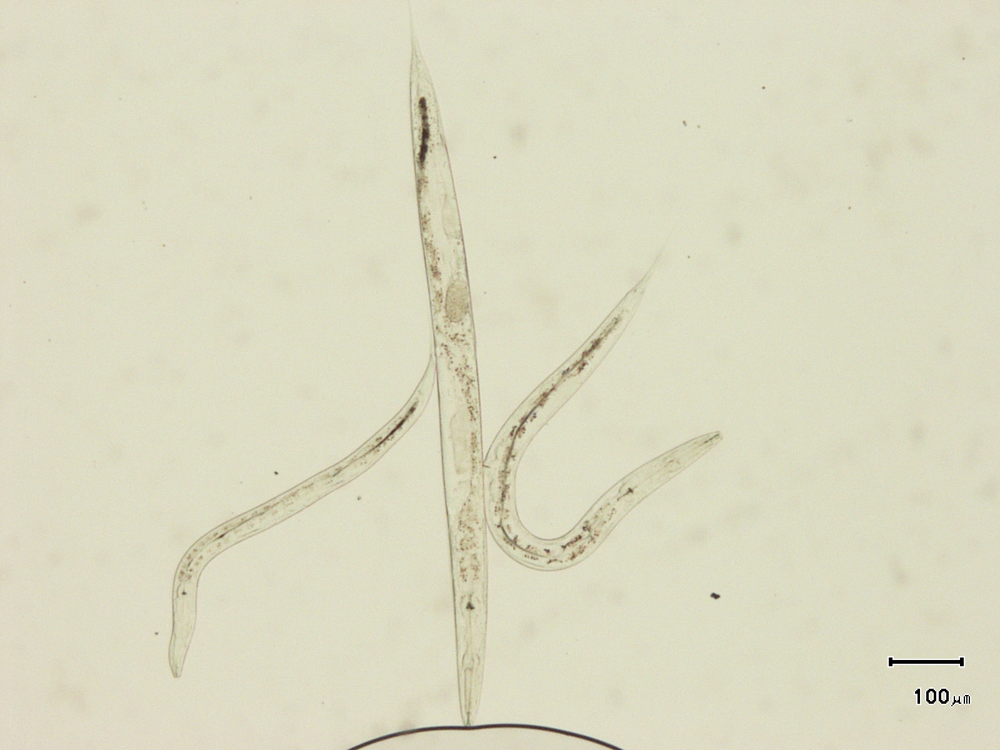</td>
    <td>e)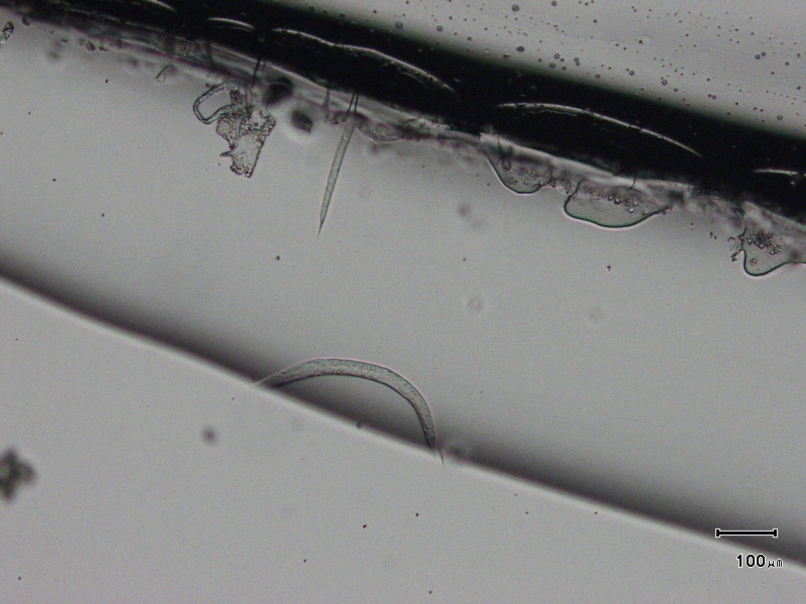</td>
    <td>f)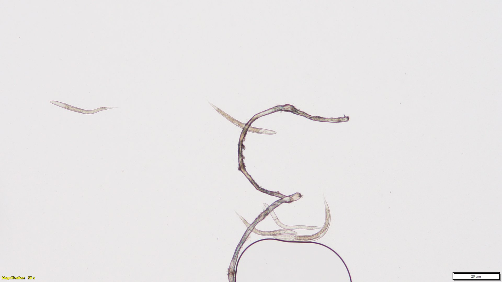</td>
  </tr>
</table>

_Table 2: Examples of undesirable images. a, b) Dirty and blurry images, but the worms might be detected correctly since they are clear. c) The worms are too coiled, which will impede skeletonization. d) The worms are touching, and they will need to be separated for analysis. e) Dirty image with irregular background, the worms will not be recognized. f) Non-worm objects are crossed with worm objects, which will impede correct detection_

### Scale setting
In the first step, the program will prompt the user to select the image or images to analyse. These must have the same magnification, as the program will use the same scale to calculate length. After selecting the images, the program will show the scale determination panel, with three options:

- Select automatically: Zoom to the scale bar, click the Select bar button, double-click the scale bar, then click the Scale value button and input the number represented by the scale bar. Then, press Done.

- Select by a line: Zoom to the scale bar, click the Draw line button, draw a line along the scale bar and double-click to confirm, then input the length unit in the Scale Value button and press Done.

- Introduce numerical value: Input the Scale Value in pixels per unit, and press OK. Usually used after determining this number with one of the previous two methods for the same or similar images, shown as Scale Value before pressing Done, as seen in the image below.

 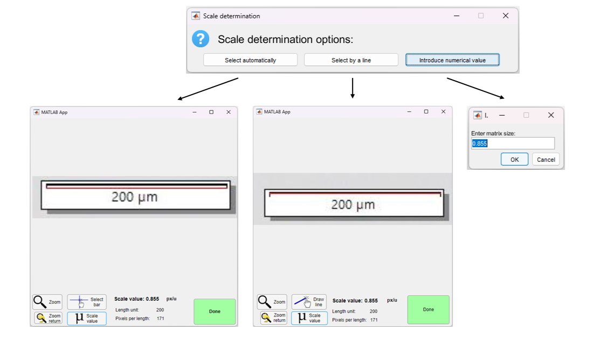  

_Figure 3: Scale determination options. The input value for the first two options is 200. The scale value is seen in the first two options to be 0.855 pixels per unit, which is the number to input for the last option. The units, in this case, will be &mu;m._

> [!TIP]
> The last used scale numerical value can be found at `Documents/WorMe_Length_Results/Results_out/Internal_code_files/escale_line.txt` 

### Image processing panel

After setting the scale, WorMe shows the image processing panel, shown in Figure 4 below. In it, the user determines the modifications that will be done to all images. 

The aim of this panel is to isolate each worm as a binary object. This means applying the right filters until the background is black and the worms are white and separate from each other, and there are no other white areas. The white area is also known as a mask.

 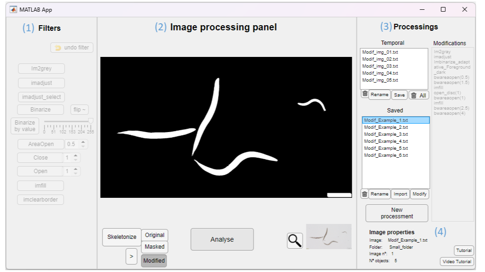

_Figure 4: Image processing panel, with (1) Filters, (2) the main panel, (3) Processings and (4) Image Properties_

The panel consists of four sections:
1. Filters: Consists of different buttons that can be used to set filters to the images. Normally, it is not used. They consist of converting the image to grayscale (im2gray), improving the contrast (imadjust), binarizing the image (Binarize, flip and Binarize by value), and removing noise and filling holes (AreaOpen, Close, Open, imfill, imclearborder).
2. Image processing panel: Consists of the image display and the following buttons:
    - Skeletonize: Shows the skeletons in the binarized objects with a red line, which is what is measured for worm length.
    - Original: Shows the original image
    - Masked: Shows the worm masks. More information in [Image data export](#image-data-export).
    - Modified: Shows the binarized image.
    - Arrow: Shows the next image.
    - Magnifying glass: Zooms in the image
    - Analyse: Runs the image analysis and continues to the next step
3. Processings: Consists of three sections and one button:
    - Temporal section: Shows temporary modifications. Useful to add more filters, or start from the original image.
    - Saved section: Shows finished modifications. Usually, one of these will work as needed for the next step.
    - New processment button: Adds a new Temporal modification, which can be used to add custom filters. 
    - Modifications section: Lists the filters applied to get the current displayed image from the original image.
4. Image properties: Shows which image is currently in display.

Usually, selecting one of the sets of modifications present in the Saved section of Processings is enough to obtain a good modified image. For example, as seen in Figure 4, the first modification shows a modified image of Table 1a) which has a black background with all worms in white and no noise, besides the scale bar. This is a good modification which will enable WorMe to get accurate length measurements.

Sometimes, however, none of the modifications are good. This usually happens when attempting to analyse images that are not compound microscopy images. For example, fluorescence images tend to have black worms and white background, and stereomicroscopy images tend to miss worms due to differences in lighting at different parts of the image.

In this case, it might be worthwhile to attempt a new image processing. The steps to take are the following:
1. In (3) Processings, click the New processment button. This will add `Modif_img_06.txt` at the Temporal section.
2. With `Modif_img_06.txt` selected, add some (1) Filters. The results of the filters can be seen step by step on the Image display, so one can undo if the results are not as expected.
    1. Convert the image to grayscale (im2gray)
    2. Improve the contrast (imadjust)
    3. Binarize the image. This is a useful step for improving worm visualization.
        - If binarization with the Binarize button needs improvement, try changing the value and using the Binarize by value button
        - If, after binarizing, the worms are black and the background white, use the flip button.
4. Clean up the image by removing noise and filling holes (AreaOpen, Close,
Open, imfill, imclearborder). Not all filters might be needed.
3. With the save icon button in the Saved section, you can save the applied filters for
images of the same type. These can be imported with the import icon button.
4. Press the Analyse button in the (2) Image Processing Panel. 

### Selection panel

After pressing the Analyse button, WorMe will show the selection panel, found in Figure 5 below. In it, the images are processed individually according to the earlier modifications. For each binary object, there is a skeletonization and branch reduction process, which is further explained in [Skeletonize and branch reduction](#skeletonize-and-branch-reduction), and the length of the resulting skeleton will represent the length of the worm. The user must assess each of the obtained binary objects.

The aim of this panel is to select the binary objects that correctly depict a worm, correct the objects that are worms but have incorrect skeletonization and reject the rest. 

The manual selection is time consuming, but it ensures the quality of the measurement data, as the user is aware of what is being measured and how. Furthermore, the computational time of the process has been optimized by working with indexated data, which can be seen in [Computational optimization](#computational-optimization).

 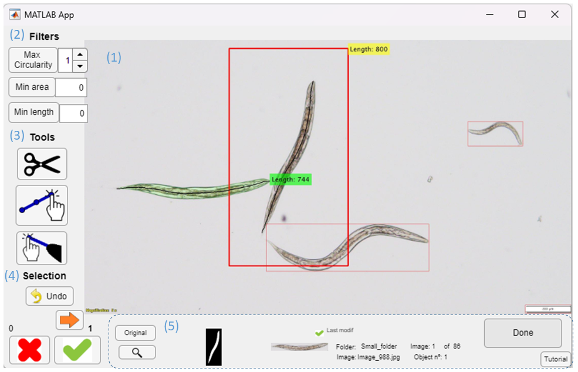

_Figure 5: Image selection panel, with (1) the main panel, (2) Filters, (3) Tools, (4) Selection and (5) Image properties_

The panel consists of five sections:
1. Main panel: Shows the processed binary objects surrounded in red bounding boxes. As the selection progresses, it shows accepted objects in green (such as the worm with length 744), rejected objects in red, and the current object in a bold line (such as the worm with length 800).
2. Filters: Consists of input areas that can filter binary objects. For example, to remove small dirt objects from the selection process.
    - Max circularity: Filters by circularity
    - Min area: Filters small objects by mask area
    - Min length: Filters short objects by skeletonization length
3. Tools: Consists of tools that can modify the binary object's mask. All of them can be used by clicking once to extend a line, and twice to finish and confirm. The mask of the current binary object will be shown as a grey overlay.
    - Scissors (R): Permits cutting the current binary object in two.
    - New line (F): Permits adding a new worm. It will be automatically selected as correct.
    - Extend line (C): Permits extending the current binary object. For example, to include a tail that was not previously detected.
4. Selection: Consists of buttons to accept or reject worms.
    - Undo (W): Undoes the last action.
    - Orange arrows (Q, E): Skip to the next image, or go back to the previous one.
    - Red cross (A): Rejects current binary object.
    - Green checkmark (D): Accepts current binary object
5. Image properties: Shows which image is in display.
    - Original (S): Shows the original image with no bounding boxes.
    - Magnifying glass: Zooms in the current Main panel.
    - Binarized object: Shows the binarized object in the main panel.
    - Tutorial: Shows keyboard shortcuts for Tools, Selection and Image Properties buttons. They have been added between brackets next to the button name.
    - Done: Finishes worm selection and continues to the next step.

The process of worm selection is detailed in the following steps:
1. The object to analyse is surrounded by a bounding box. 
2. If it is a worm, and its skeletonization is correct, press the green checkmark. If it is not a worm, press the red cross. Then, the program will go back to step (1) for the next binary object.
3. If it is a worm, but its skeletonization is incorrect, the Tools will be used to correct it.
    - If two worms are connected, use the Scissors to split the mask in two. Then, two binary objects will be separated.
    - If the worm's head or tail is not included in the skeleton, use Extend line from within the existing mask to extend the skeleton.
    - If the worm is too coiled and thus the skeleton does not follow its length, use the Scissors to cut off the wrong part, then use Extend line to add the rest.
    - If the worm was not detected, use New line to add a new binary object. This binary object will be automatically accepted as a worm.
4. After correction, the program will go back to step (1) with the new binary objects.
5. When all objects have been sorted, press the Done button to continue to the next step.

There are other steps that can be taken to streamline or correct the selection process:
- Filtering: Sometimes, the dirt in the image will be detected as very small worms. If it could not be fixed with image processing, it can be filtered out by setting a minimum length for potential worms.
- Undo button: if there is a mistake (for example, accepting a non-worm, or making an error with a Tool), it can be undone with this button.
- Orange arrow: if all objects in the image have been sorted, the program will automatically continue to the next. However, the arrows can be used to navigate between images.
- Done button: if some images want to be discarded (for example, if they have a different scale), it is not needed to discard all their binary objects. The selection can be finished at any moment by pressing the Done button. 
- Keyboard shortcuts: their use permits faster worm selection.

### Results panel

Finally, WorMe will show the Results panel, which can be seen in Figure 6. This is the final panel where the user can see the aggregated results of the measurements from all the analysed images, and they can export this data.

 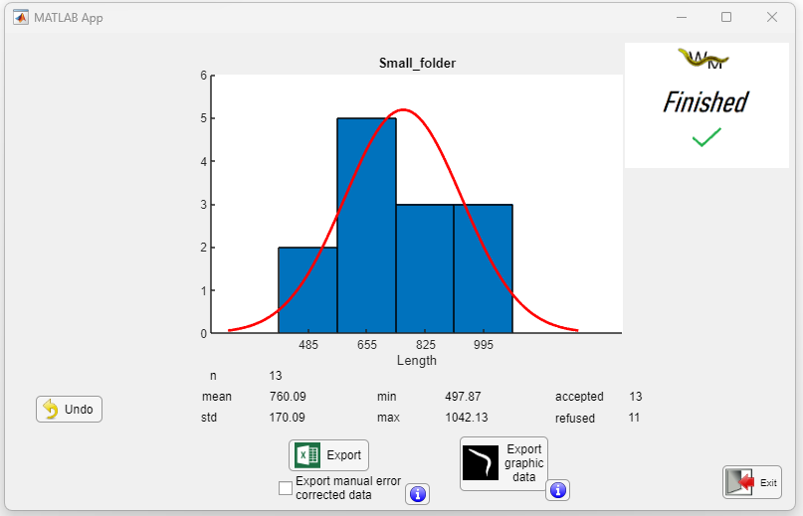

_Figure 6: Results panel_

In this panel, the user can see a histogram which contains the length results, as well as the descriptive statistics of selected worms. This length data can be saved from the Export button in `.xls`, `.xlsx`, `.csv` or `.txt` format. Furthermore, there is an "Export manual error corrected data" checkbox which, when marked, will add manual error corrected data to the Export file. This correction allows the data to be compared to manually measured data from ImageJ or similar image analysis. More information can be found in [Manual length error correction](#manual-length-error-correction).

Graphic data, which consists of Binary Images, Indexed Images and PascalVOC files from both accepted and discarded binary objects, can also be obtained from the Export Graphic Data button. This data can be useful for both _a posteriori_ worm morphology analysis as well as Deep Learning model development. More information can be found in [Image data for the analysis and deep learning use](#image-data-for-the-analysis-and-deep-learning-use). 

> [!TIP]
> The image processing parameters can be found at `Documents/WorMe_Length_Results/Results_out` with the date and hour of the analysis.

### Example of usage

Three sets of _C. elegans_ microscopical example images have been provided in these repository. These are images at different stages of the nematodes' growth, and can be found at [C24](examples/Example_images_C24), [C48](examples/Example_images_C48) and [C72](examples/Example_images_C72).

In each of these folders, you can also find three other files which were obtained after WorMe measurements:
- `C_XX_length_results.csv`, for the worms' length results,
- `C_XX_graphic_results.zip`, for image results,
- `C_XX_parameters.txt`, for the scale values, image processment and selection tools used during the analysis.

In this section, we present two different examples of the use of WorMe. A [graphic tutorial](#graphic-tutorial), which shows the analysis of the C48 example folder, and a [fast tutorial](#fast-tutorial), which explains the most basic usage of the WorMe program.

#### Graphic tutorial
 

<strong>Select the images</strong>

First, the user selects the images to analyze. The program will save the image paths.

  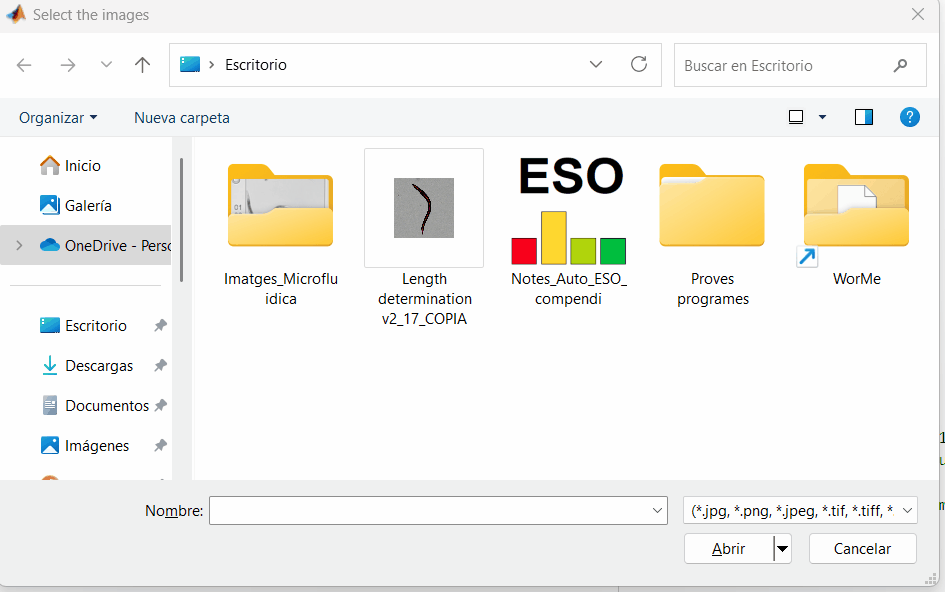

<strong>Set the scale</strong>

Then, the user needs to set the scale. One way to do it is by tracing a line along the scale bar.

  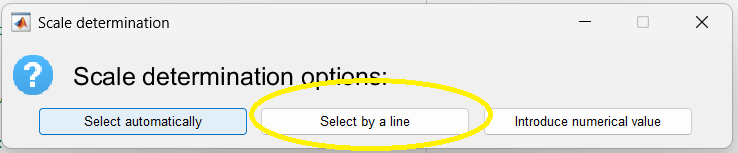

This is done on a series of steps as follows:

  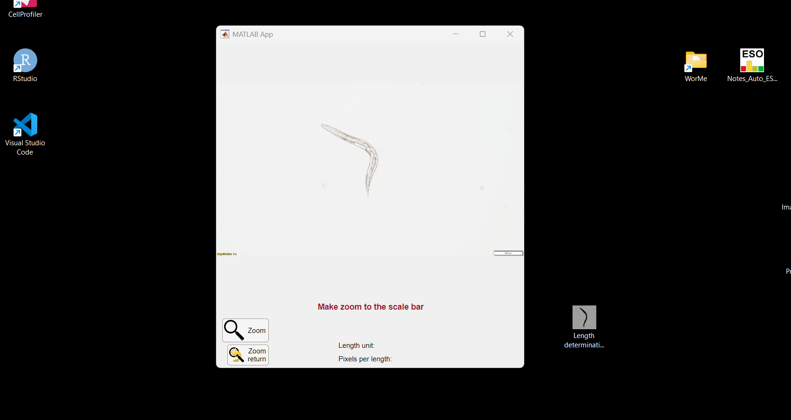

 

<strong>Configure the image modifications</strong>

Once the scale is set, the image needs to be processed. This consists of applying filters until the background is black and the worms are white and separate from each other. The white areas will be binary objects, and these will be the basis for the length analysis.

First, the user should check whether one of the Saved image processings works well for the selected images. If none do, the user should start a new processing and set the image filters manually.

  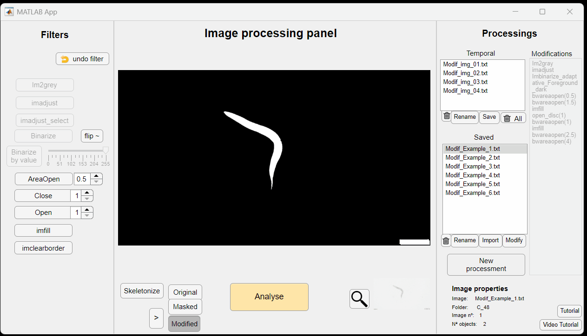

<strong>Select the worms</strong>

Next, the user will manually sort the binary objects according to whether they are a worm or not. In case a worm was not detected or it was detected wrongly, the Tools can edit the binary objects by:

- Scissors: Cutting the object in two.
- New Line: Adding a new object.
- Extend Line: Lengthen the object.

  

<strong>Obtain the results</strong>

Then, the user can save the length results of the selected worms in a spreadsheet, as well as [the manual error bias correction](#manual-length-error-correction) values.

  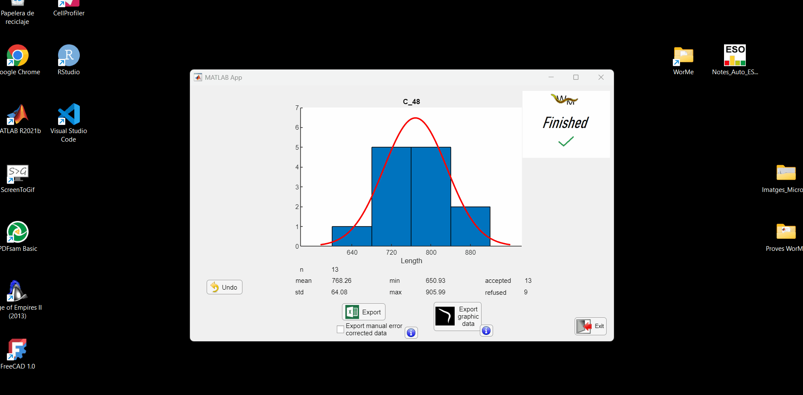

Furthermore, the user can obtain the binary objects files, which may be useful to analyse the morphology of the worms, or to train deep learning models.

  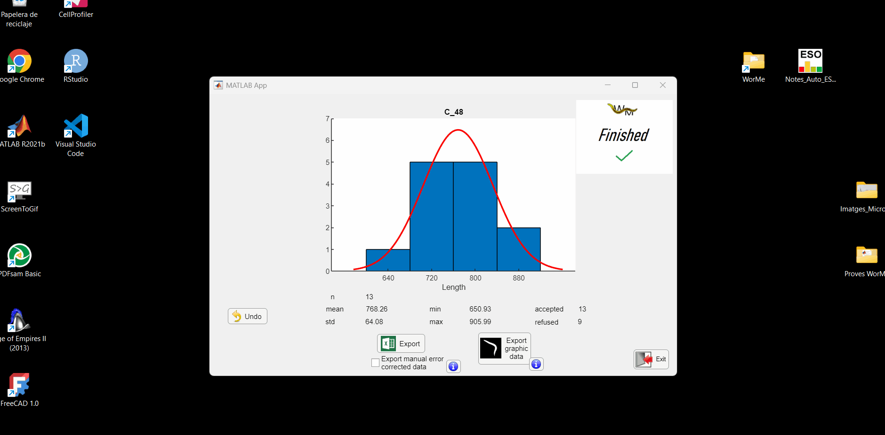

#### Fast tutorial

There are five steps to use WorMe. 

1. **Image selection**: Select the images to analyse. We will use this image as an example.

 

> [!IMPORTANT]
> Sometimes, an "Invalid or deleted object" error will appear due to exiting the program before going through all the steps. If the error persists when starting the program again, the easiest solution is to delete the `Documents/WorMe_Length_Results` folder.

2. **Scale setting**: Set the measuring scale by selecting the scale bar. With "Select Automatically" the user must double click the scale bar and then input the displayed length number. In this example, it is 200.

3. **Image processing**: Configure the image modifications. Select from the Saved options in Processings the one that shows the worms the best. In this case, we used `Modif_Example_4.txt`. Then, press Analyse.

 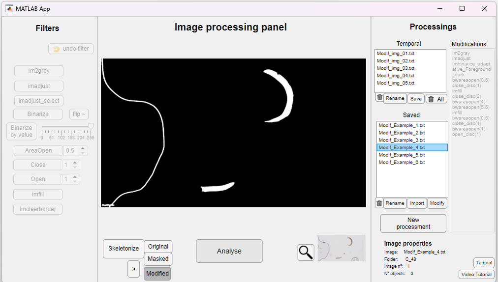

4. **Worm selection**: Select the worm objects manually. If the marked object is a worm, press the green checkmark. If it is not, the red cross. The Tools can modify the objects: the Scissors cut the current object in two, the New Object allows the user to trace a new object, and the Extend Object allows the user to lengthen the current object. Then, press Done.

 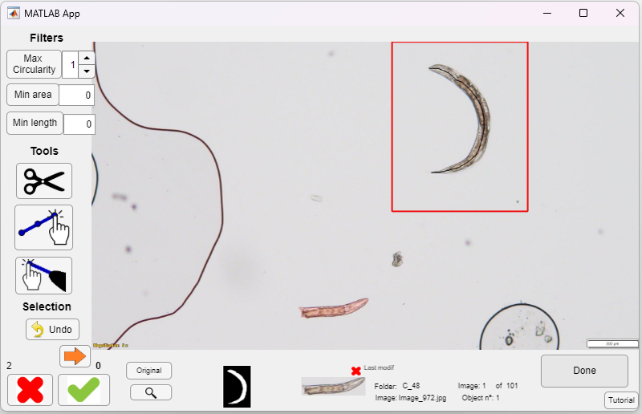

5. **Results**: Press the export button to save the data. Select the "Export manual error corrected data" if the data requires comparison with other manual methods of measurement such as ImageJ.

## Software Methodology

[Image and data processing](#image-and-data-processing)  
[Skeletonize and branch reduction](#skeletonize-and-branch-reduction)  
[Endline elongation](#endline-elongation)  
[Length determination](#length-determination)  
[Manual length error correction](#manual-length-error-correction)  
[Image data](#image-data)  
[Computational optimization](#computational-optimization)

### Image and data processing

WorMe is based in MATLAB, and uses a wide range of image processing tools which allows to easily visualize and analyse the image in a fast and optimized way, as well as the data treatment.  

Once the images are loaded and the scale i settled, the user configure the image modification. In this step, the RGB image becomes to a grayscale, to become a binary image which objects of interest will be saved.  

  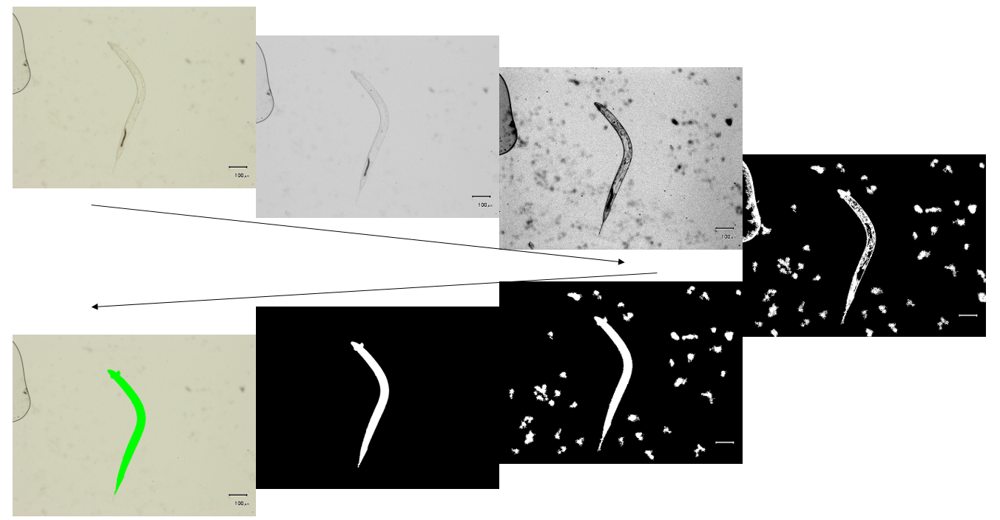

An RGB image means Red-Green-Blue image. We can understand an image as a 3 numerical matrix which every matrix have the 0 to 255 values of red, green and blue pixels. The combination of the three colors in every pixel results a color pixel. For example, orange is (255, 165, 0).  

  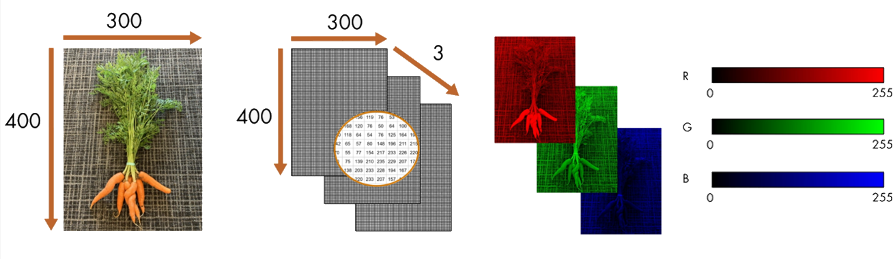

  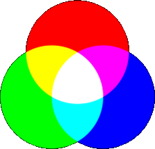

This is converted to grayscale image. In this case, the image is just a matrix of 0 to 255 pixels, where the ranges of colours for every pixels goes from 0 as black to 255 as white, being in a gray scale of colors. As it is understood as a matix, we can operate with the values of it, increasing or decreasing it, filtering and having numerical operations.  

  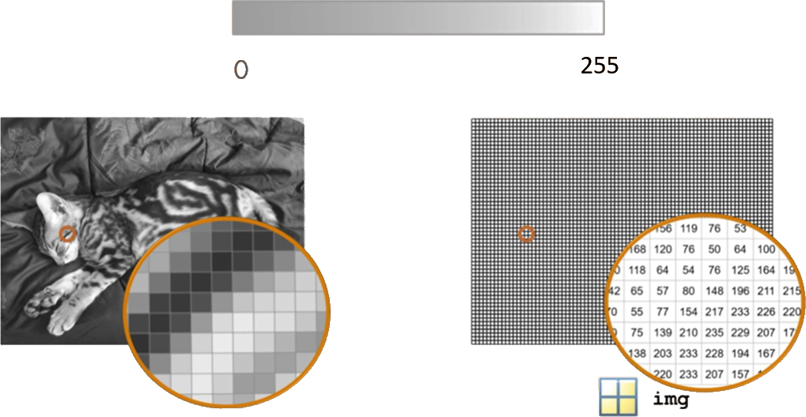

In order to obtain a single region of the image (Region of Interest: ROi), we filter some desired values of the image by a threshold, and discrimine the parts of the image we are interested in, or not. This results in an image called mask, where every pixel would have the value of zero (0) or one (1).

  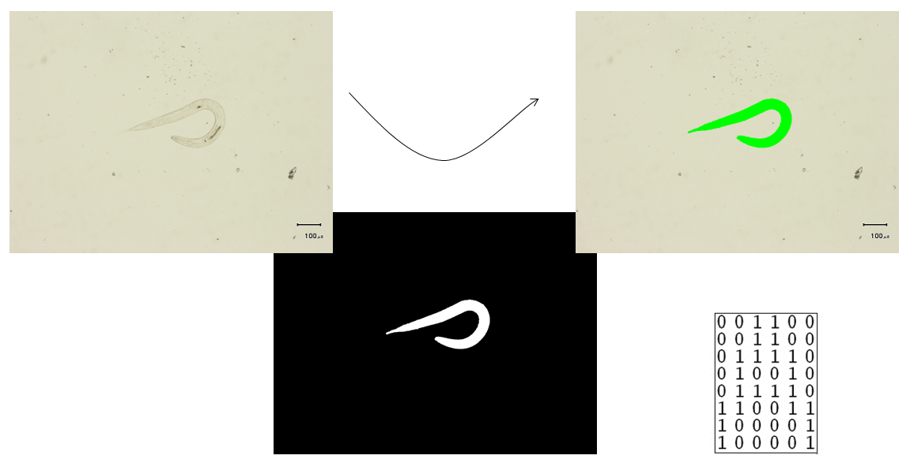

  <em>Fig 5. Example of a Region of Interest. </em>

On this matrix we can operate easily, and we can finally reduce our parts of interest (worms), in order to obtain the pixels which configurate it and, in our case, obtain the length of the figures.  

  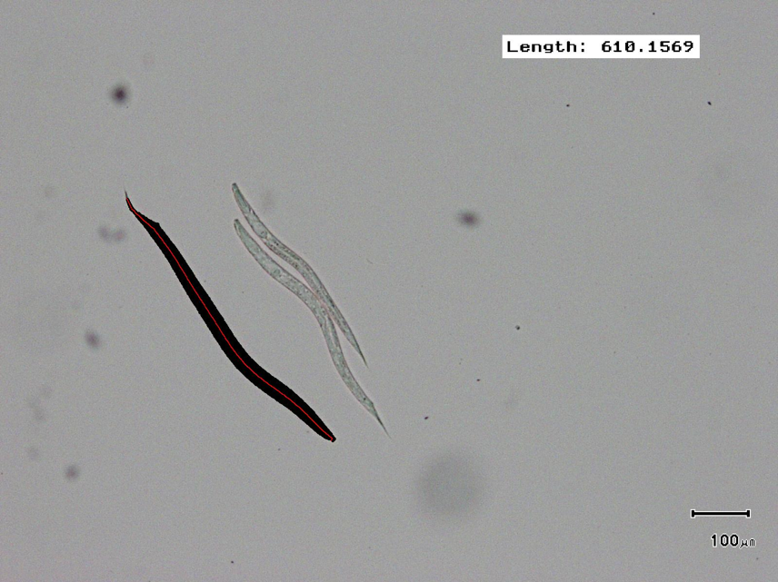

The processing of the images is developed by the user in modification panel. Image must be converted from Red-Green-Blue (RGB) to grayscale, to binary image, in order to isolate in these the desired objects, which are the worms.  

 We can operate with and analyse the objects in the binary image, for example isolating objects of interest, or analysising the morphology properties like length, circularity, area, etc. In WorMe there is many tools for operate with the objects, with the aim to obtain a mask in which we had the worms.

#### Image processing using MATLAB tools
The image processing functions used in the program are part of the MATLAB Toolboxes. For the image processment and analysis, the toolboxes [MATLAB Image Processing Toolbox](https://es.mathworks.com/products/image-processing.html), and the [MATLAB Computer Vision Toolbox](https://es.mathworks.com/products/computer-vision.html) offered a wide, useful and optimized variety of image processment and analysis functions.  
Some of the image functions mainly used in the progarm are:  
`imcrop()`:   Allows to easily cut the image from specific coordinates. This may help to opearte and select the objects and ROi.  
`im2gray()`:   Automatically converts the RGB image into grayscale.  
`imadjust()`:   Automatically adjust and normalize the greyscale values of the image.  
`imbinarize()`:   Binarize the image from a threshold, which may be statistically determined.  
`bwareaopen()`:   Allows to easy and fast cleaning of the small objects in the image.  
`imopen()` and `imclose()`:   Allows to reduce or expand the binarized objects, in order to reduce or increase their properties (ex: worm tail and profile).  
`imclearborder()`:   Automatically deletes the objects that touch the edges of the image.  
`imfill()`:   Automatically fills the binary objects, allowing the analysis of that ones.  

These functions are executed in the `processament_imatge_llistat` funcion in the program, which works based in the descrived list from Processment pannel of image modification and its values.  

  

The implementation of the functions in the program has been tested and adapted to the *C. elegans* microscopical images. Numerous test has been developed in order to accurate the optimus functions and their configuration for the kind of images and its ROi. For example, most of the functions has been adapted to percentual values from the image, not by unique numerical values, in order to adapt the processment to the user images.  

  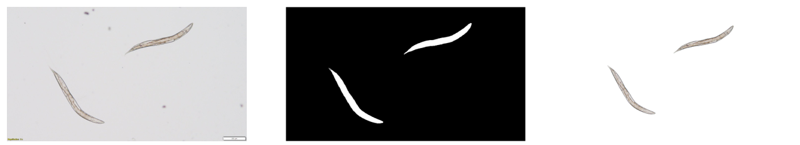

  <em>Fig 6. Selection of the regions of interest (worms) of the initial image. </em>

### Skeletonize and branch reduction

Once the worm binary object is obtained, in order to obtain its length the image is skeletonized, then the branches are pruned to obtain the main length, and then the endpoints are extended. By this operations, we went from a binary object to have their main central line, which is analogue at the manual drawed one.

The skeletonization is the reduction from the binary object to a line. It is achieved by gradually reducing the surroundings of the image until achieves a line. In MATLAB it is developed by the `bwskel()` function [10].

The prune of the short branches in the skeleton image is developed by the own made function `large_skel_iter()`. This returns the main branch from a skeletonized object.

Finally, because the skeletonization endpoints used to not touch the borders of the object, a function was created for lengthen the lines from endpoints to the object. This function was the `extendre_skel_estes_nou()` in the program. This allows to approximate the measure from the head to the tail of the C. elegans.

Softwares like WormSizer and AnliLength [] describe the development of the function to prune and extend the skeletonized image.

  

#### Endline elongation
Before we figure out about the [manual length error](#manual-length-error-correction), in order to slightly improve the length measurement,  the start and finals of the reduced-skeletonized line was elongated to the final of the obect.  
The final skeletonized line obatined from the worm image doesnt reach the finals of the ROi, of the worms. We thought at first it was the cause of the [difference between manual measurement and software](#manual-length-error-correction). In consequence, in order to accurate as much as we could the measurement, we incorporate functions that elongate the final of the measurement line.  
The functionalities are developed in the functions (ççç).

  
  

  
  

  <em>Figure X: (Left) Image processing panel. (Right) Another panel.</em>

  
  

  <em>Figure X: (Left) Image processing panel. (Right) Another panel.</em>

### Length determination

The determination of the length of C. elegans in the image is the main objective of the program. We have the aim to automatize the hand-drawed length of *C. elegans*. Because of that, the program main objective is to draw a line throughout the worm in its center in order to obtain the length from it.  

When the measure of the length is made by manually, using programs like ImageJ [5], usually a polyline is described from the tail to the head of C. elegans, or reverse, going through the middle of the body if possible. The length of the worm in ImageJ is defined from the sum of the Euclidean distance of the dotted points descrived in the drawing process.  

When, in difference, the line is traced throughout the body of the worm, like the line obtained from the skeletonization, the length distance of C. elegans can be calculated also as the sum of the Euclidean points, in this case, between each pixel next to the other, in a one-pixel-width line. This generate a difference. ççç

(Descriure la funció en el codi del programa)

  

### Manual length error correction
These numbers are less accurate than the regular WorMe results, but may be useful to compare them to manual length measurements.

Between the manual length and the pixel line length is used to there is a substantial difference, being the pixel length measure slightly higher. This is because of the lack of measurement in curved worms when their manual length is developed. The difference exist because the pixels between the pixel line describes a long distance than the two points of the manual annotation.

In the program we stack in the verification of the length result comparison, and realise about this difference. We realise that error appear not in the vertical, horizontal or diagonal forms, but in the curved ones. 

We studied the difference between these annotations, and realized that the error was minimal if the length was taken every 5 pixels of the manual distance. The program offers the possiblity to obtain the data by this bias, in order to adjust the data to the manual inherent error.

A short study showing the difference of results is described in Results - Manual error.

  

  

One of the main steps for the validation of the program was verification of the data measured with those from manual measurements. From the start, the program attempt to reproduce the same measurement line as the manual measurement.

We used a set of worm images for to develop the comparison, as well as different drawed lines as a kind of stable image control. 

We saw the data didn’t match in the worms, and we improved the reproducivity of line, reaching the point the skeletonized line reach the final parts of the worm (see annex: extend the line to the tail).

We change the controls adding serpentined lines, and the controls then didn’t match.

We analyse the way distance was obtained in manual drawing, seeing the distance was made between the points the user made for to develop the line, and not by the line by itself. 

We figure out the bias was because of this length methodology of measurement. When we develop the euclediant distance every a certain number of pixels throughout the computer-drawn line we had a proportional dismiss of the error which made the data statistically the same. We find the difference was almost non-significant when the distance was almost 5 pixels difference between points.

(grafic distancia per pixel)

### Image data

Finally the program visualize the set of length measurement data, and allows to export it. It includes also the option to export the data based in the manual error correction (see XXX). The program also provides the binary object data and other data that may be golden standard for deep learning models.

WorMe does not use artificial intelligence (AI) despite it is the state-of-the-art of the image processing and analysis. Many software are based on deep learning neural networks for the selection or identification of C. elegans in the images. Despite that, the program is consciousness about the data obtaintion and use for the creation of models, and it allows the user to export the graphical data in different formats (PascalVOC, label, binary, etc.) in order to be used for IA model building, among other types of analysis.

As is usual, the program does not used to differentiate between coiled and joined worms. Some IA based softwares can approach this differentiation [1-4]. Despite that, the panel offer tools for manually separate and differentiate between two or more joined C. elegans or objects. 

 

State of the art: Artificial intelligence: There is still much to do in C. elegans

Many of the recent software use Deep Learning  (DL) as the basis for image processing. Despite of the it, there is still the necessity of good DL models for develop the image segregation, and to compile image segmented data in C. elegans is still a requirement. 

### Computational optimization

The program’s computational operation has been optimized in order to rely a good timing in the processment and analysis of the image and objecs, and in the time of using by the user.

Computational optimization has been a must in the development of the program because of its proper use. Many of the image processing and data handling functions have been optimized, making the program work with indexed image data and disk-storage, among other strategies (See more information in Annex: XXX).

Most of the functions using the program are MATLAB, and we used it as possible because they are per se fully optimized.

The result is that in 8Gb RAM i5 CPU the elapsed time for a main object processment in the selection panel is 0,03 seconds (← approximate, must validate).

In the selection panel the whole image is processed and their objects are isolated in a MATLAB file, saved in as indexed coordinates because of the computational optimization. For every object the skeletonization and operation is developed and showed, and the selection done by the user is saved. 

WorMe works using the rute of the selected images (in the code: *theFiles* variable). The image data is saved in a , and saves the main data of images and analysis in physical files.  
ççç explicar els passos i com es guarden les dades.

## Comparison to ImageJ and WorMachine

----------------------------------------------

*This project has been granted by the JAE Intro grant for the introduction of young people to the research, by the Ministerio de Ciencia, Innovacion y Universidades ([ciencia.gob.es](https://www.ciencia.gob.es/)) y el Consejo Superior de Investigaciones Científicas ([CSIC](https://www.csic.es/es)).*  

  

