# User Manual - WorMe: *Caenorhabditis elegans* length determination

# Table of Contents

1. [Introduction](#introduction)
2. [Software description, use and features](#software-description-use-and-features)
3. [Use of the program](#use-of-the-program)
4. [Example of usage](#example-of-usage)
5. [Software Methodology](#software-methodology)
6. [Comparison to ImageJ and WorMachine](#comparison-to-imagej-and-wormachine)

## Introduction

*Caenorhabditis elegans* is a widely used animal model for biomedical research. The length of the nematode is a quantifiable parameter to assess its development. Currently, there are many tools that automatize this process. However, most of the available tools are designed for images from stereomicroscopes, and none were found that worked reliably for compound microscopy images. 

Here we present WorMe, a *Caenorhabditis elegans* length determination software. WorMe is a MATLAB Runtime application that automatizes the length measurements from compound microscopy images. It is open-source and user-friendly, since it works from a graphical user interface. WorMe is also versatile, because it has a wide range of settings to process many kinds of images, and it ensures data reliability since the user selects the worms to be analysed in a computationally optimized process.

The program accepts multiple images as input, which can then be analysed collectively. Furthermore, the user can discard wrongly-detected objects, separate joined worms, correct erroneous measurements and manually add new worms. Then, the results are presented in a spreadsheet file, with each measurement linked to their image. 

## Software description, use and features
### Brief description of the program 

WorMe is an open-source application implemented in *MATLAB version 9.11 (R2021b)* and deployed as an executable using MATLAB Runtime, so it can be installed and run without a license. It provides automatic detection and measurement of the length of *C. elegans* from microscopy images. It consists of a linear set of pannels that correspond to image processing, worm selection and results.  

First, the program prompts the user to provide the images to analyse. The user can select one or multiple images as long as the scale is consistent. Then, the program will show the image processing panel, where the images are processed to isolate the worms as binary objects. This is done by converting the image to grayscale (MATLAB function `im2gray`), improving the contrast (`imadjust`), binarizing the image (`imbinarize`), and removing noise and filling holes (`bwareaopen`, `imopen`, `imclose`, `imfill`, `imclearborder`). The user can select from a list of different sets of image modifications or apply their own if none display a workable result. This can happen if the contrast between worm and background is different from expected, such as when attempting to use fluoresence images. The ideal processing would show a black background with white, separate worms.

Afterwards, the program will show the worm selection panel. It will skeletonize the binary objects (`bwmorph`) and prune the branches to obtain a line along the center of each nematode. Then, the user can visualize and select the *C. elegans* to measure. If a detected object is not a worm, it can be excluded from measurement. If two worms are connected, their binary object can be split, and the program will reprocess the skeleton for each new object. If the skeleton line does not span the entire worm, it can be extended. Similarly, if it is partly erroneous, it can be cut and extended again. Finally, if a worm is not detected, it can be added via manual analysis. This panel is the most time-consuming, as the user will have to go through all binary objects to accept, reject, or correct them. However, this ensures the quality and reliability of the data.

Finally, the results panel will return a histogram of length results, which can be saved as a spreadsheet. In this document we can also include results that account for manual error, results modified so they would be similar to those obtained from manual measurement in FIJI. Graphic data such as the binary images, indexed images or PascalVOC data for other morphology measurements or AI model training can also be saved.

A tutorial can be found in [Use of the program](#use-of-the-program), and an explanation of the used functions, error correction, and optimization can be found in [Software Methodology](#software-methodology).

The program takes the selected images, processes them until it gets individual worms as binary objects which can be measured via skeletonization, lets the user select which objects are worms, and presents the length results in a spreadsheet, as well as graphic data.

   

_Figure 2: Use_

### Installation and requirements

WorMe source code and binaries can be downloaded from GitHub. The executable file can be found in releases at [https://github.com/group-nn-at-icmab-csic/WorMe/releases](https://github.com/group-nn-at-icmab-csic/WorMe/releases), and the source code at [https://github.com/group-nn-at-icmab-csic/WorMe](https://github.com/group-nn-at-icmab-csic/WorMe).

Minimal software requirements are:
- Windows 8 or later
- MATLAB Runtime R2021b (prompted to install by the WorMe binaries)
- Internet connection

Minimal hardware requirements are:
- RAM: At least 2GB
- Storage: More than 4GB available disk space (for MATLAB Runtime)
- Processor: Basic CPU (for example, Intel Core i3 2GHz or equivalent)

For example, the program works properly in a computer with 8GB RAM and an Intel Core i5 2.60GHz CPU, in Windows 10.

#### Installation from executable (.exe)

WorMe Length determination can be installed from the [executable file](https://github.com/group-nn-at-icmab-csic/WorMe/releases) as a local software in Windows. It does not require a MATLAB license, or any previous installation. When triggered, it will download and install MATLAB Runtime and WorMe Length determination as system software. 

 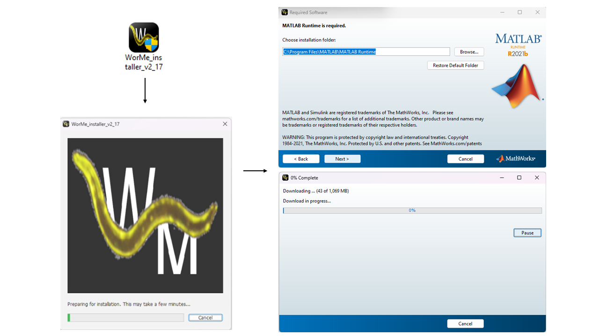 

_Figure 1: WorMe installer that triggers the installation of MATLAB runtime R2021b_

#### Use in MATLAB 

The program can also be used in the **MATLAB version 9.11 (R2021b)** interface by running the main script `WM_length_determination.m`. However, this requires a MATLAB license. Using the program this way might be slightly faster, but the system-installed program is also optimal.

The following MATLAB Toolboxes are required (See: [How to add Add Ons in MATLAB](https://es.mathworks.com/help/matlab/matlab_env/get-add-ons.html)):
- Computer Vision Toolbox
- Image Processing Toolbox
- Image Acquisition Toolbox
- Statistics and Machine Learning Toolbox

## Use of the program

The use of WorMe is based in five continuous steps:  

→ [Image selection](#image-selection): Seleccion of the images. 
→ [Scale setting](#scale-setting): Set of the scale. 
→ [Image processing](#image-processing-panel): Configure the image modification.  
→ [Worm selection](#selection-panel): Select manually the worm objects. 
→ [Results](#results-panel): Read and download the results (data and image objects).  

<table>
  <tr><td>→ <a href="#image-selection">Image selection</a></td><td>: Selection of the images.</td></tr>
  <tr><td>→ <a href="#scale-setting">Scale setting</a></td><td>: Set of the scale.</td></tr>
  <tr><td>→ <a href="#image-processing-panel">Image processing</a></td><td>: Configure the image modification.</td></tr>
  <tr><td>→ <a href="#selection-panel">Worm selection</a></td><td>: Select manually the worm objects.</td></tr>
  <tr><td>→ <a href="#results-panel">Results</a></td><td>: Read and download the results (data and image objects).</td></tr>
</table>

For a fast tutorial, please refer to [Example of usage](#example-of-usage).

### Image selection

WorMe can operate with many image formats, such as JPG, PNG, TIFF, JFIF and BMP. They can be rgb or grayscale images.

The program is designed for compound microscopy images with standard proportions, but it can operate with different types of resolutions and different kinds of microscope images. The use of large resolution microscopy images is possible but not recommended as it would lead to long waiting times due to the logistics of the image processing. Therefore, we recommend lowering the image resolution before measuring worm length.

The program works best with images that are clear, without dirt, and with separate worms that are not touching, coiled or tangled. One example is Figure 4. 

 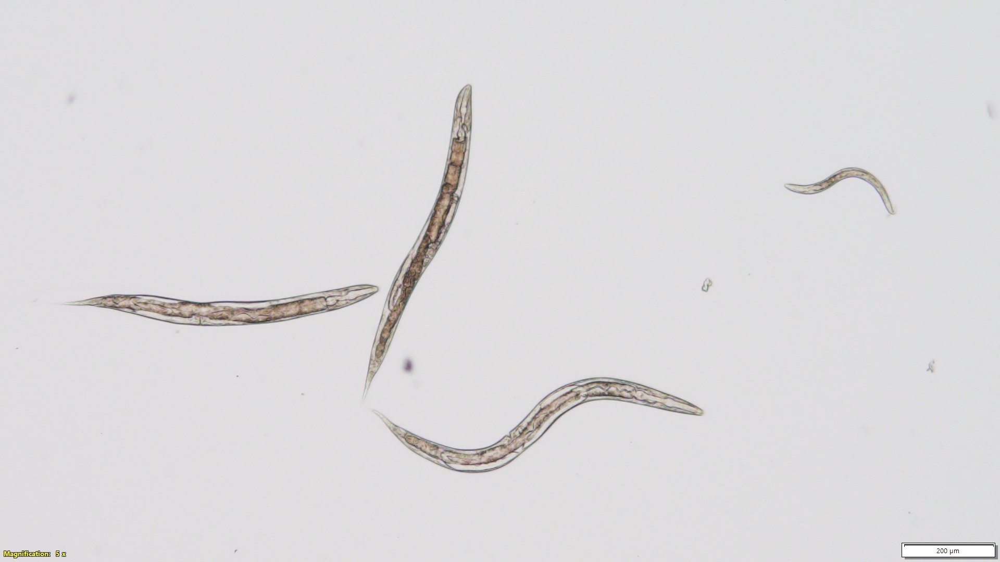 

_Figure 3: Example image_

### Scale setting
In the first step, the program will prompt the user to select the image or images to analyze. These must have the same magnification, as the program will use the same scale to calculate length. After selecting the images, the program will show the scale determination panel, with three options:

- Select automatically: Zoom to the scale bar, click the Select bar button, double-click the scale bar, then click the Scale value button and input the number represented by the scale bar. Then, press Done.

- Select by a line: Zoom to the scale bar, click the Draw line button, draw a line along the scale bar and double-click to confirm, then input the length unit in the Scale Value button and press Done.

- Introduce numerical value: Input the Scale Value in pixels per unit, and press OK. Usually used after determining this number with one of the previous two methods for the same or similar images, shown as Scale Value before pressing Done, as seen in the image below.

 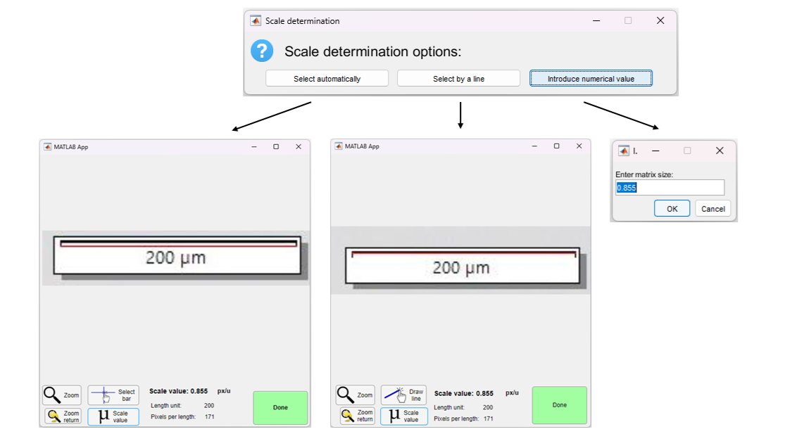  

_Figure 4: Scale determination options. The scale value is seen in the first two options to be 0.855 pixels per unit, which is the number to input for the last option._

### Image processing panel

After setting the scale, WorMe shows the image processing panel, shown in the image below. In it, the user determines the modifications that will be done to all images. 

The aim of this panel is to isolate each worm as a binary object. This means applying the right filters until the background is black and the worms are white and separate from each other, and there are no other white areas.

 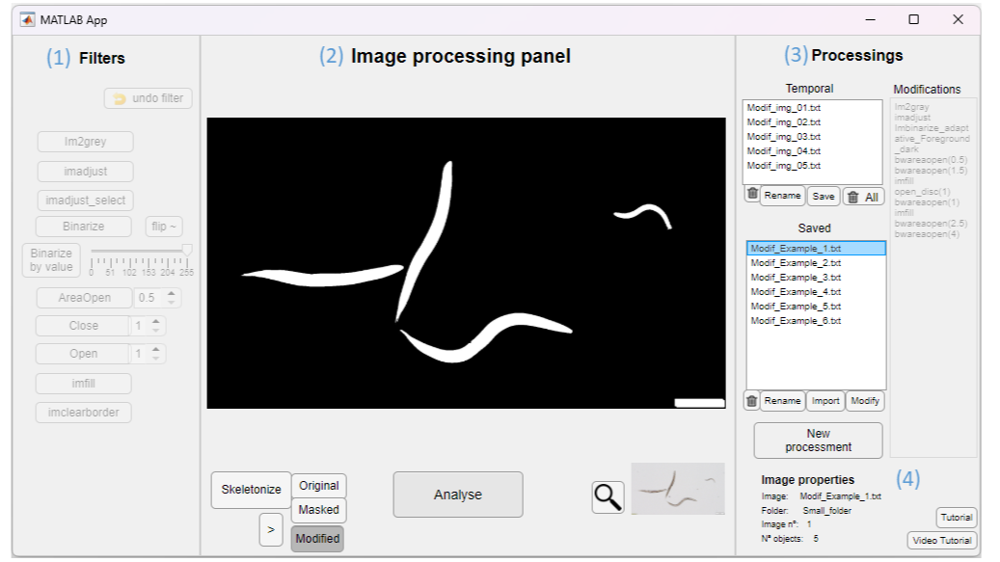

_Figure 5: Image processing panel, with (1) Filters, (2) the main panel, (3) Processings and (4) Image Properties_

The panel consists of four sections:
1. Filters: Consists of different buttons that can be used to set filters to the images. Normally, it is not used. They consist of converting the image to grayscale (im2gray), improving the contrast (imadjust), binarizing the image (Binarize, flip and Binarize by value), and removing noise and filling holes (AreaOpen, Close, Open, imfill, imclearborder).
2. Image processing panel: Consists of the image display and the following buttons:
    - Skeletonize: shows the skeletons in the binarized objects with a red line, which is what is measured for worm length.
    - Original: Shows the original image
    - Masked: Shows the worm masks. More information in [Image data export](#image-data-export).
    - Modified: Shows the binarized image.
    - Arrow: Shows the next image.
    - Magnifying glass: Zooms in the image
    - Analyse: Runs the image analysis and continues to the next step
3. Processings: Consists of three sections and one button:
    - Temporal section: shows temporary modifications. Useful to add more filters, or start from the original image.
    - Saved section: Shows finished modifications. Usually, one of these will work as needed for the next step.
    - New processment button: Adds a new Temporal modification, which can be used to add custom filters. 
    - Modifications section: lists the filters applied to get the current displayed image from the original image.
4. Image properties: Shows which image is currently in display.

Usually, selecting one of the sets of modifications present in the Saved section of Processings is enough to obtain a good modified image. For example, as seen in Figure 5, the first modification shows a modified image of Figure 3 which has a black background with all worms in white and no noise, besides the scale bar. This is a good modification, which will enable WorMe to get accurate length measurements.

Sometimes, however, none of the modifications are good. This usually happens when attempting to analyze images that are not compound microscopy images. For example, fluorescence images tend to have black worms and white background, and stereomicroscopy images tend to miss worms due to differences in lighting at different parts of the image.

In this case, it might be worthwhile to attempt a new image processing. The steps to take are the following:
1. In (3) Processings, click the New processment button. This will add `Modif_img_06.txt` at the Temporal section.
2. With `Modif_img_06.txt` selected, add some (1) Filters.

The user must determine which set of image modifications will be applied to the stack of images. This modifications can be saved and imported, and they are used to be the same for same types of images. The versatility of image processing allows to operate into different kinds of images and objects. 

### Selection panel

When the modification configuration is determined, start the selection panel. Images are individually processed by the configuration, and every object is analysed. In this step user can select as worm or as not worm the object that is surrounded by a bounding box. The user can move between the images and can finish the selection at the desired moment.

In this panel user can filtrate the objects mainly by length, area and circularity. There is also three tools for the object modification. Scissors allows to crop the objects, which is useful for example if two worms are joined. Draw line allows to draw a line that will be the length of the worm. The extension button is used for extend the objects, something that can be useful when there is a cropped part.

In the worm selection pannel, the user visualise and selects each worm’s measurement. That may be time-consuming, but the computational and usage have been optimized in order to improve and adapt the process.

In this step the image is processed and the objects are analysed based on the previous defined image processing settings automatically. The computational time consumption of this process has been optimized by working with indexated data (see Computational optimization). 

The user-timing in the selection has been improved (example: shortkeys) trying to accelerate the selection process.

This manual selection panel is time consuming, but ensures the user to be aware in-time of the origin and quality of the measurement data, preventing bias.

 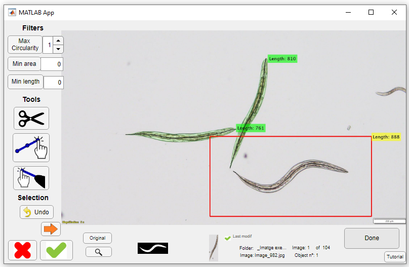 

### Results panel

Finally, after select the worms in the image, apperas the result panel. In this, user can see the an histogram with the results and descriptive statistics of the worms selected. The data of the length measures can be exported, as well as with the manual error correction (see below the apartat ASD). 

User can also export the graphic data. This allows exporting the binary images, labelled images, as well as PascalVOC files of the images which objects were selected. This type of images can be useful for a posteriori object analysis as well as for the use of it in the AI model development.

  

Finally the program visualize the set of length measurement data, and allows to export it. It includes also the option to export the data based in the manual error correction (see  ([Manual length error correction](#manual-length-error-correction) ). The program also provides the binary object data and other data that may be golden standard for deep learning models.

#### Image data export
?
WorMe does not use artificial intelligence (AI) despite it is the state-of-the-art of the image processing and analysis. Many software are based on deep learning neural networks for the selection or identification of C. elegans in the images. Despite that, the program is consciousness about the data obtaintion and use for the creation of models, and it allows the user to export the graphical data in different formats (PascalVOC, label, binary, etc.) in order to be used for IA model building, among other types of analysis.

As is usual, the program does not used to differentiate between coiled and joined worms. Some IA based softwares can approach this differentiation [1-4]. Despite that, the panel offer tools for manually separate and differentiate between two or more joined C. elegans or objects. 

 

State of the art: Artificial intelligence: There is still much to do in C. elegans

Many of the recent software use Deep Learning  (DL) as the basis for image processing. Despite of the it, there is still the necessity of good DL models for develop the image segregation, and to compile image segmented data in C. elegans is still a requirement. 

### Example of usage

We share some set of _C.elegans_ microscopical examples images. These are [C24](https://github.com/group-nn-at-icmab-csic/WorMe/tree/main/examples/Example_images_C24), [C48](https://github.com/group-nn-at-icmab-csic/WorMe/tree/main/examples/Example_images_C48) and [C72](https://github.com/group-nn-at-icmab-csic/WorMe/tree/main/examples/Example_images_C72) worm images samples of their different growth. 
Note the image tones are different between the sets of examples.  

We are going to show an example of use the use of the WorMe program using the  [C48 example images](https://github.com/group-nn-at-icmab-csic/WorMe/tree/main/examples/Example_images_C48).  

 

<strong>Select the images</strong>

First of all, we would select the images. The program doesn't load but just save the path of the images. 

  

 

<strong>Set the scale</strong>

Then, we are going to set the scale. By do it, a way is to obtain the scale from measuring the scale bar. 

  

In the program it is done in a set of steps: 

  

 

<strong>Configure the image modifications</strong>

Once we have setted the scale, we are going to define the image configuration of the modification. We are going to set the parameters of image filters in order to obtain the final binary objects, which there will be the worms. 
May be other objects in the image, but we will try to set the image in order to obtain the most clear binary image of the worms. 
These binary objects will be the basis for the length analysis. 

  

 

<strong>Select the worms</strong>

We are going to select manually the worms, and exclude or avoid these ones are not. 

  

 

<strong>Obtain the results</strong>

We can obtain the length results of the selected worms in a numeric sheet (.xlsx file), with or without [the manual error bias correction](#manual-length-error-correction). 

  

And we can obtain the image objects files, which may be useful for to analyse the morphology of the worms, and for the deep learning training models. 

  

## Software Methodology

### Image and data processing

Throughout the program, there is the image and 

The program uses a wide range of image processing tools, thanks to the MATLAB image processing functions, and allows to visualize the image processing at time. This differentiate from many software in which the image processing have few tools or are automatic, or not visual. To have many tools give versatililty allowing to analyse different types of images and figures in it.

Many of the current software are designed ad hoc, working just in a specific kind of file or image typology, demanding images in a form that many times the users cannot provide, and being in some cases not user-friendly.

--

The processing of the images is developed by the user in modification panel. Image must be converted from Red-Green-Blue (RGB) to grayscale, to binary image, in order to isolate in these the desired objects, which are the worms.

A RGB image is a color image. An image can be understood as a matrix where every pixel have a value. In case of RGB the image is composed for three matrix which values range from 0 to 255. The colour of every pixel is defined by the value combination of the three matrix; for example orange colour have (255, 165, 0) value. 

In the transition from colour to grayscale the values of three matrix are sinthetised in one singular matrix, which values range from 0 to 255. In this case, the values will define in the image a proportion of white and black colours [6-7]. As example, in MATLAB this is developed by the im2gray() function [9]. WorMe offer different options for to convert the image from colour to grayscale.

When the image is converted to a binary, the values just range from 0 to 1. This transition is used to do by applying a threshold value, in which the upper or lower values will be segmented, making what is known as a mask. In MATLAB, as example, is applied the function imbinarize() [8].  We can operate with and analyze the objects in the binary image, for example isolating objects of interest, or analysising the morphology properties like length, circularity, area, etc. In WorMe there is many tools for operate with the objects, with the aim to obtain a mask in which we had the worms.

(PHOTO PIXEL RGB VALUES?)

Much of all of the image processing functions are part of the MATLAB Image Processing Toolbox, and the MATLAB Computer Vision Toolbox. MATLAB also use (…) toolbox.

### Skeletonize and branch reduction

Once the worm binary object is obtained, in order to obtain its length the image is skeletonized, then the branches are pruned to obtain the main length, and then the endpoints are extended. By this operations, we went from a binary object to have their main central line, which is analogue at the manual drawed one.

The skeletonization is the reduction from the binary object to a line. It is achieved by gradually reducing the surroundings of the image until achieves a line. In MATLAB it is developed by the bwskel() function [10].

The prune of the short branches in the skeleton image is developed by the own made function large_skel_iter(). This returns the main branch from a skeletonized object.

Finally, because the skeletonization endpoints used to not touch the borders of the object, a function was created for lengthen the lines from endpoints to the object. This function was the extendre_skel_estes_nou() in the program. This allows to approximate the measure from the head to the tail of the C. elegans.

Softwares like WormSizer and AnliLength [] describe the development of the function to prune and extend the skeletonized image.

 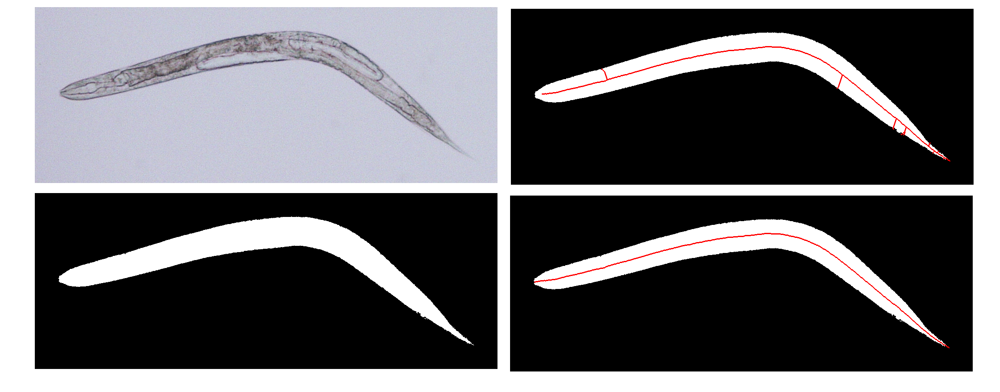 

#### Endline elongation
Before we figure out about the manual error (See: #manual-length-error-correction), in order to slightly improve the length measurement, the elongation of the final line in the reduced-skeletonized line was developed. As result of skeletonization and branch reduction, the final lines doesn't reach the real final of the worm periphery. This might cause a slighlty deviation in the measurement. In order to accurate as much as we could the measurement, we incorporate functions that elongate the final of the measurement line.
The functionalities are developed in the functions (ççç). Some proves can be shown in (ççç).

  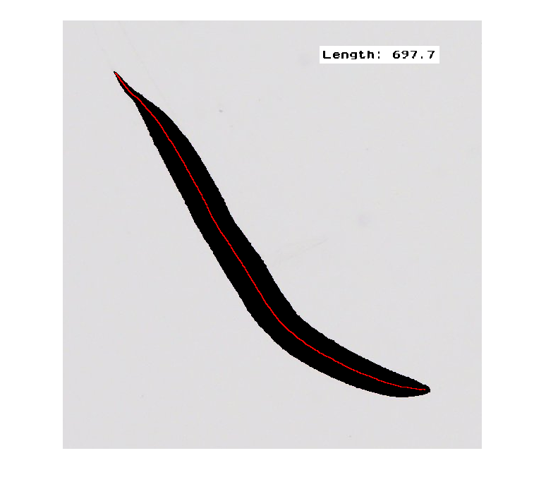
  

  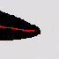
  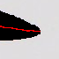

  <em>Figure X: (Left) Image processing panel. (Right) Another panel.</em>

  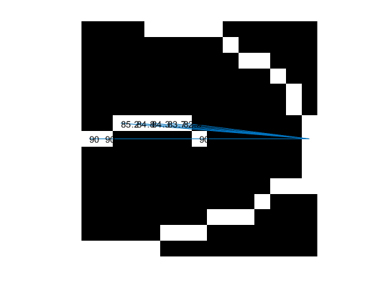
  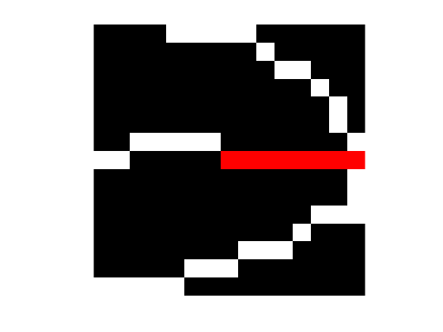

  <em>Figure X: (Left) Image processing panel. (Right) Another panel.</em>

### Length determination

 The length determination of the C. elegans in the image is the main objective of the program.

When the measure of the length is made by manually, using programs like ImageJ [5], usually a polyline is described from the tail to the head of C. elegans, or reverse, going through the middle of the body if possible. The length of the worm is defined from the sum of the Euclidean distance of the points (formula X).

When, in difference, the line is traced throughout the body of the worm, like the line obtained from the skeletonization, the length distance of C. elegans can be calculated also as the sum of the Euclidean points, in this case, between each pixel next to the other, in a one-pixel-width line.

(Descriure la funció en el codi del programa)

  

### Manual length error correction
These numbers are less accurate than the regular WorMe results, but may be useful to compare them to manual length measurements.

Between the manual length and the pixel line length is used to there is a substantial difference, being the pixel length measure slightly higher. This is because of the lack of measurement in curved worms when their manual length is developed. The difference exist because the pixels between the pixel line describes a long distance than the two points of the manual annotation.

In the program we stack in the verification of the length result comparison, and realise about this difference. We realise that error appear not in the vertical, horizontal or diagonal forms, but in the curved ones. 

We studied the difference between these annotations, and realized that the error was minimal if the length was taken every 5 pixels of the manual distance. The program offers the possiblity to obtain the data by this bias, in order to adjust the data to the manual inherent error.

A short study showing the difference of results is described in Results - Manual error.

  

  

One of the main steps for the validation of the program was verification of the data measured with those from manual measurements. From the start, the program attempt to reproduce the same measurement line as the manual measurement.

We used a set of worm images for to develop the comparison, as well as different drawed lines as a kind of stable image control. 

We saw the data didn’t match in the worms, and we improved the reproducivity of line, reaching the point the skeletonized line reach the final parts of the worm (see annex: extend the line to the tail).

We change the controls adding serpentined lines, and the controls then didn’t match.

We analyse the way distance was obtained in manual drawing, seeing the distance was made between the points the user made for to develop the line, and not by the line by itself. 

We figure out the bias was because of this length methodology of measurement. When we develop the euclediant distance every a certain number of pixels throughout the computer-drawn line we had a proportional dismiss of the error which made the data statistically the same. We find the difference was almost non-significant when the distance was almost 5 pixels difference between points.

(grafic distancia per pixel)

### Image data for the analysis and deep learning use

Finally the program visualize the set of length measurement data, and allows to export it. It includes also the option to export the data based in the manual error correction (see XXX). The program also provides the binary object data and other data that may be golden standard for deep learning models.

WorMe does not use artificial intelligence (AI) despite it is the state-of-the-art of the image processing and analysis. Many software are based on deep learning neural networks for the selection or identification of C. elegans in the images. Despite that, the program is consciousness about the data obtaintion and use for the creation of models, and it allows the user to export the graphical data in different formats (PascalVOC, label, binary, etc.) in order to be used for IA model building, among other types of analysis.

As is usual, the program does not used to differentiate between coiled and joined worms. Some IA based softwares can approach this differentiation [1-4]. Despite that, the panel offer tools for manually separate and differentiate between two or more joined C. elegans or objects. 

 

State of the art: Artificial intelligence: There is still much to do in C. elegans

Many of the recent software use Deep Learning  (DL) as the basis for image processing. Despite of the it, there is still the necessity of good DL models for develop the image segregation, and to compile image segmented data in C. elegans is still a requirement. 

### Computational optimization

The program’s computational operation has been optimized in order to rely a good timing in the processment and analysis of the image and objecs, and in the time of using by the user.

Computational optimization has been a must in the development of the program because of its proper use. Many of the image processing and data handling functions have been optimized, making the program work with indexed image data and disk-storage, among other strategies (See more information in Annex: XXX).

Most of the functions using the program are MATLAB, and we used it as possible because they are per se fully optimized.

The result is that in 8Gb RAM i5 CPU the elapsed time for a main object processment in the selection panel is 0,03 seconds (← approximate, must validate).

In the selection panel the whole image is processed and their objects are isolated in a MATLAB file, saved in as indexed coordinates because of the computational optimization. For every object the skeletonization and operation is developed and showed, and the selection done by the user is saved. 

## Comparison to ImageJ and WorMachine

