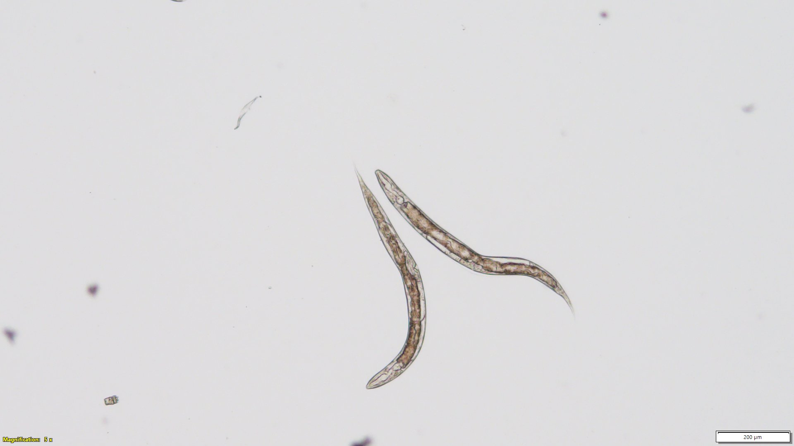
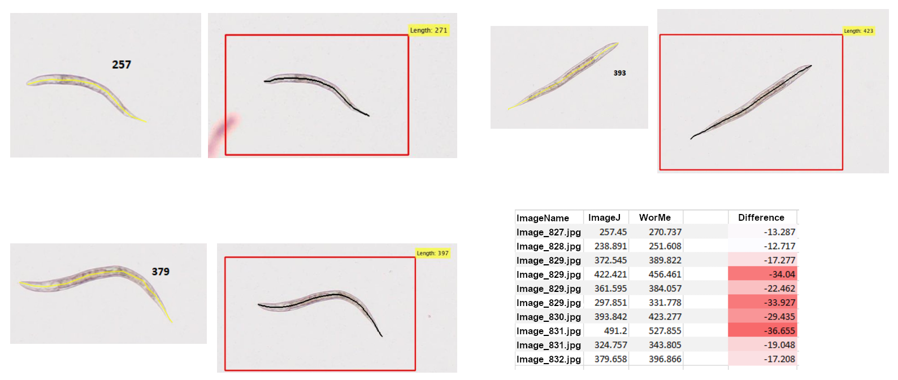

# User Manual - WorMe: *Caenorhabditis elegans* length determination

## Table of Contents

[Introduction](#introduction)  
[Installation](#installation)  
[Use of the program](#use-of-the-program)   
[Example of usage](#example-of-usage)  
[Software Methodology](#software-methodology)  

 

## Introduction

*Caenorhabditis elegans* is a widely used animal model for biomedical research. The length of the nematode is a quantifiable parameter to assess its development. Currently, there are many tools that automatize this process. However, most of the available tools are designed for images from stereomicroscopes, and none were found that worked reliably for compound microscopy images. 

Here we present WorMe, a *Caenorhabditis elegans* length determination software. WorMe is a MATLAB Runtime application that automatizes the length measurements from compound microscopy images. It is open-source and user-friendly, since it works from a graphical user interface. WorMe is also versatile, because it has a wide range of settings to process many kinds of images, and it ensures data reliability since the user selects the worms to be analysed in a computationally optimized process.

The program accepts multiple images as input, which can then be analysed collectively. Furthermore, the user can discard wrongly-detected objects, separate joined worms, correct erroneous measurements and manually add new worms. Then, the results are presented in a spreadsheet file, with each measurement linked to their image. 

### Brief description of the program 

WorMe is an open-source application implemented in *MATLAB version 9.11 (R2021b)* and deployed as an executable using MATLAB Runtime, so it can be installed and run without a licence. It provides automatic detection and measurement of the length of *C. elegans* from microscopy images. It consists of a linear set of pannels that correspond to image processing, worm selection and results.  

WorMe takes the selected images and processes them until it gets individual worms as binary objects, which are skeletonized. Afterwards, the user selects which objects are worms, and the program measures the length of the skeletonization, which corresponds to the length of the worm. This manual selection ensures the quality and reliability of the data, as the user can see what is being measured.

Then, the program presents the length measurements in a spreadsheet. In this step, the program can account for manual error, and it can transform the results into values that would be equivalent to those obtained from manual measurements in programs such as FIJI ImageJ.

Furthermore, the program also provides graphic data, such as binary images, indexed images or PascalVOC data, which would be useful for training Deep Learning models. 

A tutorial can be found in [Use of the program](#use-of-the-program), and an explanation of the used functions, error correction, and optimization can be found in [Software Methodology](#software-methodology).

   

_Figure 1: Use of the program_

## Installation

WorMe is a MATLAB based software that **does not require a MATLAB licence**. It can be easily installed and executed in one of these two options:  
- Install as local software from the [executable file](https://github.com/group-nn-at-icmab-csic/WorMe/releases) (.exe). This does not require a MATLAB licence, because the program is compiled.
- Execute [the source code](https://github.com/group-nn-at-icmab-csic/WorMe/Length_determination/WM_length_determination.m) from the MATLAB Desktop environment software (version >2021b). This requires a MATLAB licence but it has a slightly faster execution time.

The program requires at least 4GB of available disk space, as well as a Windows Operating System. 

### Installation and use from the executable (.exe)

WorMe Length determination can be **easily installed from the [executable file](https://github.com/group-nn-at-icmab-csic/WorMe/releases)** as a local software in Windows. **It does not require a MATLAB licence**. A [brief installation guide](https://github.com/group-nn-at-icmab-csic/WorMe/blob/main/documentation/WM_ld_Installation_guide.pdf) was developed.  
The step-by-step installation will automatically download and install MATLAB Runtime R2021b (9.11) and WorMe Length determination as system software. [MATLAB Runtime](https://mathworks.com/products/compiler/matlab-runtime.html) is a collection of the libraries required to run MATLAB aplications, in this case WorMe Length determination.

  

_Figure 2: WorMe installer that triggers the installation of MATLAB runtime R2021b_

### Installation and use from the source code 

The program can also be used by by running the main script [`WM_length_determination.m`](https://github.com/group-nn-at-icmab-csic/WorMe/blob/main/Length_determination/WM_length_determination.m) in MATLAB version R2021b or greater. However, a MATLAB licence is required.  

In this case, the program uses a few toolboxes which are needed for its execution (See: [How to add Add Ons in MATLAB](https://es.mathworks.com/help/matlab/matlab_env/get-add-ons.html)):
- [Computer Vision Toolbox](https://es.mathworks.com/products/computer-vision.html)
- [Image Processing Toolbox](https://es.mathworks.com/products/image-processing.html)
- [Image Acquisition Toolbox](https://es.mathworks.com/products/image-acquisition.html)
- [Statistics and Machine Learning Toolbox](https://es.mathworks.com/products/statistics.html)

The use of the program from the MATLAB Desktop environment software is slightly faster, but the local-installed program is also optimal.

## Use of the program

The use of WorMe is based in five continuous steps:  

→ [Image selection](#image-selection): Select the images to analyse. 
→ [Scale setting](#scale-setting): Set the measuring scale. 
→ [Image processing](#image-processing-panel): Configure the image modification parameters.  
→ [Worm selection](#selection-panel): Select worm objects manually. 
→ [Results](#results-panel): Read and download the results (data and image objects).  

For a fast tutorial, please refer to the repository's [README file](../README.md). For a video tutorial, please proceed to [Example of usage](#example-of-usage).

### Image selection

The program is designed for compound microscopy images with standard proportions, but it can operate with different resolutions and different kinds of microscope images. To change the selected images, the program must be restarted.

> [!IMPORTANT]
> Sometimes, an "Invalid or deleted object" error will appear due to exiting the program before going through all the steps. If the error persists when starting the program again, the easiest solution is to delete the `Documents/WorMe_Length_Results` folder.

#### Image formats
WorMe can operate with a wide range of image formats, including RGB and grayscale images.

Compatible image types are: `.jpg`, `.png`, `.jpeg`, `.tif`, `.tiff`, `.jfif` and `.bmp`.

Non-compatible image types are: `.gif` and `.webp`.

Nevertheless, WorMe is designed for single-layer images. Therefore, it is not compatible with multi-layer or multi-page optical microscopy `.tiff` images. 

#### Image resolution
The selected images can have any resolution, and it is not necessary for it to be uniform between them. 

However, the use of large resolution microscopy images (over 25000 x 25000 px) is possible but not recommended as it would lead to long waiting times due to the logistics of the image processing. Therefore, we recommend lowering the image resolution before measuring worm length.

#### Desired image quality
The program can adapt to any image quality. Even so, it works best with images that are clear, with regular brightness and contrast, without dirt, and with separate worms that are not touching, coiled or tangled.

Examples of desirable and undesirable images can be found below, in Tables 1 and 2, respectively. Of course, as long as the worms in undesirable images are recognizable by the naked eye, they can still be measured manually within WorMe.

In the experimental design, one may consider using cleaning methods of the final plate before image adquisition, which would improve the image analysis step.  

<table>
  <tr>
    <td>a)</td>
    <td>b)</td>
    <td>c)</td>
  </tr>
  <tr>
    <td>d)</td>
    <td>e)</td>
    <td>f)</td>
  </tr>
</table>

_Table 1: Examples of desirable images. The background is bright, clean and with regular contrast, and the worms are not coiled or touching. The exceptions are e) where a worm is coiled at the top, and f) where there are some bubbles, but as they are far from the other worms, they do not impede analysis._

<table>
  <tr>
    <td>a)</td>
    <td>b)</td>
    <td>c)</td>
  </tr>
  <tr>
    <td>d)</td>
    <td>e)</td>
    <td>f)</td>
  </tr>
</table>

_Table 2: Examples of undesirable images. a, b) Dirty and blurry images, but the worms might be detected correctly since they are clear. c) The worms are too coiled, which will impede skeletonization. d) The worms are touching, and they will need to be separated for analysis. e) Dirty image with irregular background, the worms will not be recognized. f) Non-worm objects are crossed with worm objects, which will impede correct detection_

### Scale setting
In the first step, the program will prompt the user to select the image or images to analyse. These must have the same magnification, as the program will use the same scale to calculate length. After selecting the images, the program will show the scale determination panel, with three options:

- Select automatically: Zoom to the scale bar, click the Select bar button, double-click the scale bar, then click the Scale value button and input the number represented by the scale bar. Then, press Done.

- Select by a line: Zoom to the scale bar, click the Draw line button, draw a line along the scale bar and double-click to confirm, then input the length unit in the Scale Value button and press Done.

- Introduce numerical value: Input the Scale Value in pixels per unit, and press OK. Usually used after determining this number with one of the previous two methods for the same or similar images, shown as Scale Value before pressing Done, as seen in the image below.

   

_Figure 3: Scale determination options. The input value for the first two options is 200. The scale value is seen in the first two options to be 0.855 pixels per unit, which is the number to input for the last option. The units, in this case, will be &mu;m._

The selection of the scale main function can be found in `scale_determination_main()`, executed from the main script `WM_length_determination.m`.  

> [!TIP]
> The last used scale numerical value can be found at `Documents/WorMe_Length_Results/Results_out/Internal_code_files/escale_line.txt` 

### Image processing panel

After setting the scale, WorMe shows the image processing panel, shown in Figure 4 below. In it, the user determines the modifications that will be done to all images. 

The aim of this panel is to isolate each worm as a binary object. This means applying the right filters until the background is black and the worms are white and separate from each other, and there are no other white areas. The white area is also known as a mask.  

The image processing panel can be found in `app_image_processment()` app, executed from the main script `WM_length_determination.m`.

 

_Figure 4: Image processing panel, with (1) Filters, (2) the main panel, (3) Processings and (4) Image Properties_

The panel consists of four sections:
1. Filters: Consists of different buttons that can be used to set filters to the images. Normally, it is not used. They consist of converting the image to grayscale (im2gray), improving the contrast (imadjust), binarizing the image (Binarize, flip and Binarize by value), and removing noise and filling holes (AreaOpen, Close, Open, imfill, imclearborder).
2. Image processing panel: Consists of the image display and the following buttons:
    - Skeletonize: Shows the skeletons in the binarized objects with a red line, which is what is measured for worm length.
    - Original: Shows the original image
    - Masked: Shows the worm masks. More information in [Image data export](#image-data-export).
    - Modified: Shows the binarized image.
    - Arrow: Shows the next image.
    - Magnifying glass: Zooms in the image
    - Analyse: Runs the image analysis and continues to the next step
3. Processings: Consists of three sections and one button:
    - Temporal section: Shows temporary modifications. Useful to add more filters, or start from the original image.
    - Saved section: Shows finished modifications. Usually, one of these will work as needed for the next step.
    - New processment button: Adds a new Temporal modification, which can be used to add custom filters. 
    - Modifications section: Lists the filters applied to get the current displayed image from the original image.
4. Image properties: Shows which image is currently in display.

Usually, selecting one of the sets of modifications present in the Saved section of Processings is enough to obtain a good modified image. For example, as seen in Figure 4, the first modification shows a modified image of Table 1a) which has a black background with all worms in white and no noise, besides the scale bar. This is a good modification which will enable WorMe to get accurate length measurements.

Sometimes, however, none of the modifications are good. This usually happens when attempting to analyse images that are not compound microscopy images. For example, fluorescence images tend to have black worms and white background, and stereomicroscopy images tend to miss worms due to differences in lighting at different parts of the image.

In this case, it might be worthwhile to attempt a new image processing. The steps to take are the following:
1. In (3) Processings, click the New processment button. This will add `Modif_img_06.txt` at the Temporal section.
2. With `Modif_img_06.txt` selected, add some (1) Filters. The results of the filters can be seen step by step on the Image display, so one can undo if the results are not as expected.
    1. Convert the image to grayscale (im2gray)
    2. Improve the contrast (imadjust)
    3. Binarize the image. This is a useful step for improving worm visualization.
        - If binarization with the Binarize button needs improvement, try changing the value and using the Binarize by value button
        - If, after binarizing, the worms are black and the background white, use the flip button.
4. Clean up the image by removing noise and filling holes (AreaOpen, Close,
Open, imfill, imclearborder). Not all filters might be needed.
3. With the save icon button in the Saved section, you can save the applied filters for
images of the same type. These can be imported with the import icon button.
4. Press the Analyse button in the (2) Image Processing Panel. 

### Selection panel

After pressing the Analyse button, WorMe will show the selection panel, found in Figure 5 below. In it, the images are processed individually according to the earlier modifications. For each binary object, there is a skeletonization and branch reduction process, which is further explained in [Skeletonize and branch reduction](#skeletonize-and-branch-reduction), and the length of the resulting skeleton will represent the length of the worm. The user must assess each of the obtained binary objects.

The aim of this panel is to select the binary objects that correctly depict a worm, correct the objects that are worms but have incorrect skeletonization and reject the rest. 

The manual selection is time consuming, but it ensures the quality of the measurement data, as the user is aware of what is being measured and how. Furthermore, the computational time of the process has been optimized by working with indexated data, which can be seen in [Data architecture and computational optimization](#data-architecture-and-computational-optimization).

The selection panel function can be found in `app_selection_pannel()` app, executed from the main script `WM_length_determination.m`.  

 

_Figure 5: Image selection panel, with (1) the main panel, (2) Filters, (3) Tools, (4) Selection and (5) Image properties_

The panel consists of five sections:
1. Main panel: Shows the processed binary objects surrounded in red bounding boxes. As the selection progresses, it shows accepted objects in green (such as the worm with length 744), rejected objects in red, and the current object in a bold line (such as the worm with length 800).
2. Filters: Consists of input areas that can filter binary objects. For example, to remove small dirt objects from the selection process.
    - Max circularity: Filters by circularity
    - Min area: Filters small objects by mask area
    - Min length: Filters short objects by skeletonization length
3. Tools: Consists of tools that can modify the binary object's mask. All of them can be used by clicking once to extend a line, and twice to finish and confirm. The mask of the current binary object will be shown as a grey overlay.
    - Scissors (R): Permits cutting the current binary object in two.
    - New line (F): Permits adding a new worm. It will be automatically selected as correct.
    - Extend line (C): Permits extending the current binary object. For example, to include a tail that was not previously detected.
4. Selection: Consists of buttons to accept or reject worms.
    - Undo (W): Undoes the last action.
    - Orange arrows (Q, E): Skip to the next image, or go back to the previous one.
    - Red cross (A): Rejects current binary object.
    - Green checkmark (D): Accepts current binary object
5. Image properties: Shows which image is in display.
    - Original (S): Shows the original image with no bounding boxes.
    - Magnifying glass: Zooms in the current Main panel.
    - Binarized object: Shows the binarized object in the main panel.
    - Tutorial: Shows keyboard shortcuts for Tools, Selection and Image Properties buttons. They have been added between brackets next to the button name.
    - Done: Finishes worm selection and continues to the next step.

The process of worm selection is detailed in the following steps:
1. The object to analyse is surrounded by a bounding box. 
2. If it is a worm, and its skeletonization is correct, press the green checkmark. If it is not a worm, press the red cross. Then, the program will go back to step (1) for the next binary object.
3. If it is a worm, but its skeletonization is incorrect, the Tools will be used to correct it.
    - If two worms are connected, use the Scissors to split the mask in two. Then, two binary objects will be separated.
    - If the worm's head or tail is not included in the skeleton, use Extend line from within the existing mask to extend the skeleton.
    - If the worm is too coiled and thus the skeleton does not follow its length, use the Scissors to cut off the wrong part, then use Extend line to add the rest.
    - If the worm was not detected, use New line to add a new binary object. This binary object will be automatically accepted as a worm.
4. After correction, the program will go back to step (1) with the new binary objects.
5. When all objects have been sorted, press the Done button to continue to the next step.

There are other steps that can be taken to streamline or correct the selection process:
- Filtering: Sometimes, the dirt in the image will be detected as very small worms. If it could not be fixed with image processing, it can be filtered out by setting a minimum length for potential worms.
- Undo button: if there is a mistake (for example, accepting a non-worm, or making an error with a Tool), it can be undone with this button.
- Orange arrow: if all objects in the image have been sorted, the program will automatically continue to the next. However, the arrows can be used to navigate between images.
- Done button: if some images want to be discarded (for example, if they have a different scale), it is not needed to discard all their binary objects. The selection can be finished at any moment by pressing the Done button. 
- Keyboard shortcuts: their use permits faster worm selection.

### Results panel

Finally, WorMe will show the Results panel, which can be seen in Figure 6. This is the final panel where the user can see the aggregated results of the measurements from all the analysed images, and they can export this data.

 

_Figure 6: Results panel_

In this panel, the user can see a histogram which contains the length results, as well as the descriptive statistics of selected worms. This length data can be saved from the Export button in `.xls`, `.xlsx`, `.csv` or `.txt` format. Furthermore, there is an "Export manual error corrected data" checkbox which, when marked, will add manual error corrected data to the Export file. This correction allows the data to be compared to manually measured data from ImageJ or similar image analysis. More information can be found in [Manual length error correction](#manual-length-error-correction).

Graphic data, which consists of Binary Images, Indexed Images and PascalVOC files from both accepted and discarded binary objects, can also be obtained from the Export Graphic Data button. This data can be useful for both _a posteriori_ worm morphology analysis as well as Deep Learning model development. More information can be found in [Image data for the analysis and deep learning use](#image-data-for-the-analysis-and-deep-learning-use). 

> [!TIP]
> The image processing parameters can be found at `Documents/WorMe_Length_Results/Results_out` with the date and hour of the analysis.

### Example of usage

Three sets of _C. elegans_ microscopical example images have been provided in these repository. These are images at different stages of the nematodes' growth, and can be found at [C24](examples/Example_images_C24), [C48](examples/Example_images_C48) and [C72](examples/Example_images_C72).

In each of these folders, you can also find three other files which were obtained after WorMe measurements:
- `C_XX_length_results.csv`, for the worms' length results,
- `C_XX_graphic_results.zip`, for image results,
- `C_XX_parameters.txt`, for the scale values, image processment and selection tools used during the analysis.

In this section, we present a tutorial which shows the analysis of the C48 example folder. For a fast tutorial, please refer to the repository's [README file](../README.md).

<strong>Select the images</strong>

First, the user selects the images to analyze. The program will save the image paths.

  

<strong>Set the scale</strong>

Then, the user needs to set the scale. One way to do it is by tracing a line along the scale bar.

  

This is done on a series of steps as follows:

  

 

<strong>Configure the image modifications</strong>

Once the scale is set, the image needs to be processed. This consists of applying filters until the background is black and the worms are white and separate from each other. The white areas will be binary objects, and these will be the basis for the length analysis.

First, the user should check whether one of the Saved image processings works well for the selected images. If none do, the user should start a new processing and set the image filters manually.

  

<strong>Select the worms</strong>

Next, the user will manually sort the binary objects according to whether they are a worm or not. In case a worm was not detected or it was detected wrongly, the Tools can edit the binary objects by:

- Scissors: Cutting the object in two.
- New Line: Adding a new object.
- Extend Line: Lengthen the object.

  

<strong>Obtain the results</strong>

Then, the user can save the length results of the selected worms in a spreadsheet, as well as [the manual error bias correction](#manual-length-error-correction) values.

  

Furthermore, the user can obtain the binary objects files, which may be useful to analyse the morphology of the worms, or to train deep learning models.

  

## Software Methodology

[Image and data processing](#image-and-data-processing)  
[Skeletonize and branch reduction](#skeletonization-and-branch-reduction)  
[Endline elongation](#endline-elongation)  
[Length determination](#length-determination)  
[Manual length error correction](#manual-length-error-correction)  
[Image data](#image-data)  
[Data architecture and computational optimization](#data-architecture-and-computational-optimization)

### Image and data processing

WorMe is written in MATLAB. It uses its wide range of image processing tools which allows for easy image visualization and analysis in a fast and optimized way, as well as data treatment.  

Once the images are loaded and the scale is set, the user can configure the image modifications. In this step, an RGB image is transformed to grayscale, and then to a binary image. Its objects of interest will be saved.  

  

_Figure 7: WorMe image modifications_

An RGB image is a Red-Green-Blue image. We can understand an image as 3 numerical matrices with values of 0 to 255 for red, green and blue for each pixel. The combination of the three values in every pixel results in the color of the pixel. For example, orange is (255, 165, 0).  

  

  

_Figure 8: RGB matrices_

When RGB is converted to grayscale image, the image only has one matrix of numbers from 0 to 255 for each pixel. The range of colours goes from black, at number 0; and white, at 255; with the middle values being shades of gray. As it is a numerical matrix, we can operate with its values, such as adding, substracting, filtering and other numerical operations.  

  

_Figure 9: Grayscale matrix_

Regions of Interest (ROI) are regions in the image which contain worms. In order to obtain them, we filter and keep the desired values of the image matrix by a threshold, and discriminate between the parts of the image we are interested in and the ones we are not. This results in an image called mask, where every pixel has the value of 0 (black, no interest) or one (white, interest). This process is called binarization.

  

_Figure 10: Example Region of Interest_

From this binary matrix, it is easy to isolate the ROIs or worms as binary objects. Then, we can easily operate with and and analyse the objects in the binary image. For example, we can isolate objects of interest, or analyse morphological properties like length, circularity or area. There are many tools in WorMe to operate with the objects in order to obtain a mask where there are the worms.

  

_Figure 11: Processed image with analysed worm_

#### MATLAB tools for image processing
The image processing and analysis functions used in the program are part of the MATLAB Toolboxes. The [MATLAB Image Processing Toolbox](https://es.mathworks.com/products/image-processing.html), and the [MATLAB Computer Vision Toolbox](https://es.mathworks.com/products/computer-vision.html) offer a wide, useful and optimized variety of image processing and analysis functions.

Some of the image functions mainly used in the program are:  
`imcrop()`:   Cuts the image from specific coordinates, which helps when operating and selecting the objects and ROI.  
`im2gray()`:   Automatically convert the RGB image into grayscale.  
`imadjust()`:   Automatically adjust and normalize the greyscale values of the image.  
`imbinarize()`:   Binarize the image from a threshold, which might be statistically determined.  
`bwareaopen()`:   Easy and fast cleaning of the small objects in the image.  
`imopen()` and `imclose()`:   Reduce or expand the binarized objects, in order to improve the shape of the binary object.  
`imclearborder()`:   Automatically deletes the objects that touch the edges of the image.  
`imfill()`:   Automatically fills the binary objects.  
`bwskel()`: Skeletonization of the binary image. Useful to obtain the main central line of *C. elegans*.

These functions are executed in the `processment_img_list` function in the program, which works based in the list described in the Image modification of the Processing panel and its values.  

  

The implementation of the functions in the program has been tested and adapted to *C. elegans* optical microscopy images. Numerous tests have been developed in order to find the most optimal and accurate functions and their configuration for that type of images and the ROI. For example, most of the functions have been adapted to use percentages derived from the image and not absolute values, in order to adapt the processing to the user's images.  

  

_Figure 12: Selection of the regions of interest (worms) of the initial image._

### Skeletonization and branch reduction

Once the worm as a binary object is obtained, the next step is measuring its length. The image is skeletonized, then the branches are pruned and the endpoints are extended. With this, we obtain a line along the center of the nematode, which is analogous to a line drawn manually.

Skeletonization is the reduction from a binary object to a line. It consists on gradually reducing the binary object's surroundings until it becomes a line. In WorMe, the main function that conducts the skeletonization and obtains the length of the worm object is `worm_skeletonization()`, with the MATLAB `bwskel()` function.

Pruning the short branches in the skeleton is done by the function `large_skel_iter()`, a function developed for this program. This cuts off all the branches except for the main branch.

Finally, because the skeletonization main branch does not touch the border of the binary object, a function was created to lengthen the lines to the end (see: [Endline elongation](#endline-elongation)).

  

_Figure 13: Skeletonization, branch reduction and endline elongation process_

### Endline elongation
The length of a *C. elegans* should be measured from the beginning of the head to the end of the tail. Therefore, in order to increase the accuracy of the measurements, the beginning and the end of the branch-reduced skeletonization line needs to be elongated until it touches the border of the binarized object.

This is performed by the function `skel_elongate()` inside `worm_skeletonization()`.  

  
  

_Figure 14: Length measurements before (left) and after (right) endline elongation_

  
  

_Figure 15: Detail of a *C. elegans* head's skeletonization line before (left) and after (right) endline elongation_

  
  

_Figure 16: Endline elongation process_

### Length determination

The main objective of the program is to automatically determine *C. elegans* length. The length of *C.elegans* can be obtained manually using FIJI-ImageJ, drawing a polyline from the head to the tail of the nematode, drawing through the middle of the worm as much as possible.

WorMe performs an equivalent methodology for length determination. In WorMe, a line is automatically obtained from the head to the tail of the worm mask object. Theoretically, this line is more accurate than the one manually obtained. The reason for this is explained below.

  

_Figure 17: Manual length measurement with FIJI (left) and automatic length measurement with WorMe (right)._

*C. elegans* length is obtained in the function `worm_skeletonization()`. Length is obtained through the function `worm_lenght()`, and the corrected length (see: [Manual length error correction](#manual-length-error-correction)), from `worm_length_manual()`.  

  

_Figure 18: Measurement with polyline using ImageJ_

  

_Figure 19: Skeletonized and elongated line from a _C. elegans_ mask using WorMe_

The length of the worm in ImageJ is defined as the sum of the Euclidean distance between the polyline points described in the measuring process.  

The length in WorMe is also based in the Euclidean distance between points. However, in this case, every pixel in the line is a point to consider for length determination. 

This leads to a measurement bias, since the ImageJ polyline systematically underestimates the length of the worms. Therefore, the measurements from both methods are not comparable, and some "corrected" values that introduce the same bias as ImageJ can be downloaded from the results panel (see: [Manual length error correction](#manual-length-error-correction)).  

$$\sum\limits_{i=1}^{n-1} \sqrt{(x_{i+1} - x_i)^2 + (y_{i+1} - y_i)^2}$$

$ n:$ number of points

_Equation 1: Euclidean distance_

In order to simplify and optimize the algorithm, the distance between pixels is obtained directly from the inferred Euclidean distance of pixels. This corresponds to 1 for vertical or horizontal distance, or $\sqrt{2}$ for diagonal distance (see: `worm_lenght()` function).

  

_Figure 20: [MATLAB: Distance Transform of a Binary Image](https://es.mathworks.com/help/images/distance-transform-of-a-binary-image.html?lang=en)_

  

_Figure 21: Euclidean distance detail of pixels in a skeletonized_ C. elegans.

Once the pixel distance is obtained, it is divided by the scale ratio in order to obtain the measurement of the worm in the desired units.

### Manual length error correction

There exists a meaningful difference between the measurements obtained by drawing a manual polyline (ImageJ) and the ones obtained from the skeletonization, pruning, and elongation process (WorMe). This difference results in a bias that would give problems if the user wanted to compare measurements from both programs. To this end, an alternative measurement method was added to WorMe to obtain results with the same bias as ImageJ.

During development, the main way to validate the reliability and the speed of the program was to compare WorMe with ImageJ results and time spent. The results of the same set of images for both programs should be the same, but a t-test on the mean length showed a statistically significant difference (p < 0.01). Curiously, we found that the measurements were similar for some worms and not for others, and this difference was not related to worm shape. 

  

_Figure 22: Worm length comparison between FIJI-ImageJ and WorMe measurements_

  

_Figure 23: t-test between means of FIJI-ImageJ and WorMe measurements_

Initially, we thought that [endline elongation](#endline-elongation) was causing this measurement bias, since measurements from arbitrary horizontal, vertical and diagonal lines were consistent between the two programs. However, when analysing the measurements from arbitrary curved lines, a difference between measurements was found. Therefore, the difference could not be due to the skeletonization, pruning, and elongation process.

  

_Figure 24: Measurement differences between FIJI-ImageJ and WorMe in horizontal, vertical, diagonal (45º angle), semi-diagonal (not 45º angle) and curved lines_

Then, we looked into the measurement process. In ImageJ, the length measurement is calculated as the sum of the euclidean distance between the points in the polyline manually defined by the user. However, for WorMe, the length measurement is the sum of the euclidean distance between every pixel in the skeleton line. Therefore, the discrepancy depends on how many pixels are taken into account when measuring.

  

_Figure 25: Difference in Euclidean distance measurements of FIJI-ImageJ (manual) and WorMe (Automated)_

When drawing a polyline in WorMe, the results were very similar to ImageJ, as the length measurement was obtained using the same method. Then, we attempted to find how many pixels from the skeleton line should be used to obtain comparable results between ImageJ and WorMe, so we compared the results from different pixel distances. In conclusion, if the measurement was made from the sum of euclidean distances of every 5 pixels of the skeleton line, the values were similar to those obtained from manual measurements.

  

_Figure 26: Error plot of measurement differences between ImageJ and WorMe, changing the pixel distance for WorMe measurements_

Therefore, we included a "manual error correction" checkbox that, when selected, it adds the manual bias to the results. This means that in the results spreadsheed we would get one column with regular measurements and one column that measures the same line every 5 pixels, emulating manual measurements. 

Using these corrected values, we were able to test the reliability of WorMe measurements when using worms instead of drawn lines, and we found that the results of the same set of images for both programs were the same (t-test p value > 0.8, see: [Experiments for validation](#experiments-for-validation)).

  

_Figure 27: t-test between means of FIJI-ImageJ and WorMe_ C. elegans _measurements, with WorMe measurements done every 5 pixels_

In WorMe, the function `worm_length_manual()` obtains the length of the skeleton line applying the manual error correction, measuring one every five pixels. The function `worm_lenght()` obtains the length for every pixel. Both can be found in the main function for length and skeletonization from the mask image, `worm_skeletonization()`.  

#### Examples of length data export

You can find examples of exported length data and manual error corrected data in the examples folder, for the [C_24 images](../examples/Example_images_C24/C_24_length_results.csv), the [C_48 images](../examples/Example_images_C48/C_48_length_results.csv), and the [C_72 images](../examples/Example_images_C72/C_72_length_results.csv).

#### Experiments for validation
There are two experiments that were done in order to validate the quality of WorMe's length determination. These are showed in the [Fiji_vs_WM](Fiji_vs_WM) folder. The images used for these experiments can be found in the [examples](../examples) folder. 

The [first experiment](Fiji_vs_WM/Experiment_1/) describes the manual measurement by different users in FIJI-ImageJ and compares it to an old version of WorMe (v1.4, 2022). The manual measurements were done by following [this ImageJ protocol](Fiji_vs_WM/Experiment_1/Protocol%20length%20C%20elegans%20ImageJ.pdf), and the images used are in the [Sample_images](../examples/Sample_images/) folder.

The [second experiment](Fiji_vs_WM/Experiment_2/) shows the validation of the program. This experiment uses the [C24](../examples/Example_images_C24/), [C48](../examples/Example_images_C48/) and [C72](../examples/Example_images_C72/) sets of *C. elegans* images. For each set, the measured length in FIJI-ImageJ was compared to the measured length in WorMe, applying the manual error correction. A Shapiro-Wilkinson test was applied to test for normality, and afterwards a t-test was applied to test for differences in results. The results showed that there was no statistical difference in the measurements by the two programs.

### Image data

WorMe provides image data useful for training deep learning models, or for binary object analysis, such as morphological analysis of width and shape of the worms.  

Many length-determination software are based on deep learning neural networks for the selection or identification of *C. elegans* in the images. However, WorMe does not use artificial intelligence despite its state-of-the-art image processing and analysis. Nevertheless, the program allows the user to export graphical data in different formats such as binary objects, indexed images, or PascalVOC files, which can be useful for training AI models and for morphological analysis.

  

_Figure 28: Example image. The graphic data that WorMe obtains from this image will be shown in the sections below._

#### Binary objects
Binary objects may be useful for object analysis and also for segmentation models in deep learning. The program offers the option to export these objects for the user to analyse or use them.  

<table>
  <tr>
    <td>a)</td>
    <td>b)</td>
    <td>c)</td>
  </tr>
</table>

_Table 3: Binary masks from Figure 28. a) and b) Individual binary masks, c) Joined masks._

There are many uses for the binary objects. For example, we can measure the width of the worms in any part of its length or determine the shape of the worm which can be useful to determine the phenotype. The option to use these binary objects opens an outlook of many possibilities.

  

_Figure 29: Width analysis from a worm's binary object._

#### Indexed images

Indexed images may be useful for the deep learning model creation. Some models use these kinds of images in order to create and train the model.

We offer two types of indexed images. In the first one, the objects are labeled with different values, and in the second one, all objects have the same value.

<table>
  <tr>
    <td>a)</td>
    <td>b)</td>
  </tr>
</table>

_Table 4: Indexed objects from Figure 28. a) Singular values for every object, b) Objects indexed together._

#### PascalVOC data

A PascalVOC file is a `.xml` file which may be useful for the identification of objects using bounding boxes for the creation of deep learning models. Therefore, they are included in the graphic exports.

  

_Figure 30: PascalVOC file. The bounding box coordinates are found circled in yellow._ 

#### Examples of graphic data export

You can find examples of exported graphic data in the examples folder, for the [C_24 images](../examples/Example_images_C24/C_24_graphic_results.zip), the [C_48 images](../examples/Example_images_C48/C_48_graphic_results.zip), and the [C_72 images](../examples/Example_images_C72/C_72_graphic_results.zip).

### Data architecture and computational optimization

WorMe is a user-based designed software. Therefore, there must not be many delays during its use, to improve user experience.

Image processing and image data analysis have a considerable computational time. For example, when analysing or operating on the matrix of a whole image such as opening the image with the function `imread()` or binarizing the whole image by `imbinarize()`, the computer will need time to develop this task. The time consumption is also considerable when saving or opening data.

The program's computational operations have been optimized in order to reduce delays in image processing and analysis, so that the user does not notice this delay. The software architecture and the data and image acquisition and operation have been carefully designed. For example, operations on the image matrix are done only object by object, and not in the entire image. This differs from other software such as the FIJI ImageJ plugin WormAlign, which make the user wait for the processing and analysis of the full stack of images.

In order to optimize the program, useful functions in MATLAB are the `tic` and `toc` functions, which allow us to obtain the time of a process.  

  

_Figure 31: Example of processing times testing_

The functions offered in MATLAB toolboxes and packages are already fully optimized. Therefore, they are used as much as possible for the program. Examples of these are `imbinarize()`, `imread()`, `imopen()`, among others.

  

_Figure 32: Example of time analysis in the use of the program._ 

In the selection panel, the whole image is processed and each object is isolated in a MATLAB file, saved as indexed coordinates. Then, the operations of skeletonization, branch reduction, endline elongation are done only for the selected binary object, and saved when the user confirms them.

For an 8GB RAM, Intel Core i5-1135G7 CPU, the elapsed time for processing one object in the selection panel is around 0.03 seconds.

#### Image analysis and processing

One of the most time-consuming processes in the software is the acquisition, operation and analysis of the images. For example, in an 8GB RAM Intel Core i5-1135G7 CPU computer, the time elapsed to open an image using `imread()` is 0.03 seconds, to transform the image to grayscale with `im2gray()` it is 0.002 seconds, and to `imbinarize()` 0.03 seconds.

When these functions are applied for one image or object, it does not cause much delay even if they are applied consecutively. However, when they are applied to the entire stack of images, the time span is too long, and there is a long delay when using the program. For this reason, WorMe has reduced the use of some functions as much as possible.

For example, opening and saving images takes a long time. Thus, WorMe works with the file paths. In the main script `WM_length_determination.m` the variable `theFiles` contains the file paths of the selected images, and it is used throughout the program. Another example is in the processing and selection step, where WorMe develop the functions individually to the mask objects (see: [Working with indexes](#working-with-indexes)).   

Therefore, the program reduces the delay by reducing unnecessary functions. The analysis is conducted individually for every object, for example when modifying or manually selecting the object. In this way, the functions are executed individually, which leads to short delays that are undetected.

#### RAM consumption and data acquisition

Another concern when using the program was the RAM consumption, as well as the disk memory usage. Since this is an image software, to avoid a crash due to high RAM consumption, WorMe does not save the images as local data in the program. Instead, it saves the data as local files, and acquires the information from there.

The program saves the image paths in the `theFiles` variable of the main script. These and other data is saved in the `Results_out` folder, which is found in the folder of the program if it is used from the MATLAB Desktop environment, or in `Documents` if the software was installed from the executable file.

In the `Results_out` folder, the `Internal_code_files` folder saves the predetermined image modification filters and settings. Then, the data for the specific analysis is saved in a new folder in `Results_out`, created with the date, a number, and the folder where the images to analyse were saved (for example `20250617_1057_C_72`). In here, the `escala_imatge.mat` saves the defined scale, `Processment_parameters` saves the image processing parameters, and `main_data_analysis.txt` saves the image data.

The `main_data_analysis.txt` is the file where all the data known of the image is saved, such as ROI locations, bounding box coordinates, index of the skeleton, index of the mask, worm length, etc. The acquisition and operation to and from this file was fully optimized in order to reduce delays, with the function `read_data()`. 

  

_Figure 33: Example of data saved to the_ `main_data_analysis.txt` _file._

##### Working with indexes

WorMe, as a result of its optimized computational operations and its software architecture, operates many of its functions by indexes. An index is the location of a pixel in the image, using one-dimensional coordinates. Indexation is done in the binary images, which saves the position of the mask obtained from the original image. These indexes are the basis of many of the functions, both the functions from MATLAB and the ones developed for WorMe. The use of indexes to save, open and operate with the images reduces memory usage and wall clock processing times. 

  

_Figure 34: Indexation of a binary image._ 

Note: The image data is saved in a `.txt` file instead of a `.mat` file, which would further optimize the program. However, the software structure was already settled and the functions to optimize using the `.txt` file were already developed, so it was decided not to change it.

----------------------------------------------

*This project has been funded by the JAE Intro grant for the introduction of young people to research, by the Ministerio de Ciencia, Innovación y Universidades ([ciencia.gob.es](https://www.ciencia.gob.es/)) and the Consejo Superior de Investigaciones Científicas ([CSIC](https://www.csic.es/es)).*  

  

