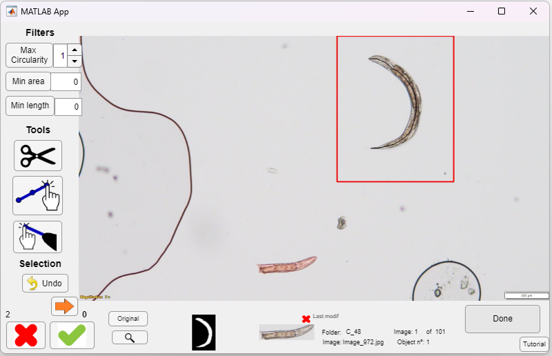

# Summary

*Caenorhabditis elegans* is a widely used animal model for biomedical research. The length of this nematode is commonly used to assess its development and its health. Typically, measurements are performed manually; however, software has been developed to automate this process. Most of these tools are designed for stereomicroscope images, and none work reliably for compound microscopy images. Here we present WorMe, a user-friendly software that measures *C. elegans* length in compound microscopy images. The program is versatile in handling various image types and can analyse multiple images collectively. Furthermore, the user can accept or discard the detected objects, separate joined worms, correct erroneous measurements, and manually add new worms. The length results are presented in a spreadsheet file, with each measurement linked to its image. Graphic data can also be exported.

# Statement of Need
*Caenorhabditis elegans* is a transparent nematode widely used as a robust early-stage research and toxicology studies model. Its small size (~1mm), short life cycle (~3days), and its proliferative cycle allow for cost-effective and high-throughput experiments [@Kaletta2006]. In addition, it is estimated that 60% of human genes have a homolog in *C. elegans* [@Markaki2020].

Body size is a crucial endpoint used to assess the nematode’s development that can be affected by dietary changes or altered temperatures [@Tain2008; @So2011; @Muoz-Juan2024]. Furthermore, in toxicity studies, the nematode’s body length is used to assess whether exposure inhibits growth [@Schrter2024; @Jung2015; @Srinivasan2023].

The length of *C. elegans* is usually measured manually from microscopy images using FIJI-ImageJ, an image analysis software [@Schindelin2012]. This method presents several disadvantages, as it is time-consuming and imprecise, since it involves manually tracing a line along the middle of each worm. Thus, the measured length would vary across attempts and experimenters.

Therefore, many software solutions have been developed to automate and improve this process, such as the WormSizer plugin for FIJI [@Moore2013], WormToolBox from CellProfiler [@Whlby2012], WormLength from QuantWorm [@Jung2014], Anilength [@Jung2021], or WorMachine [@Hakim2018], among others. Most are designed to measure length from stereomicroscope images, as they capture a large number of worms in the same picture. However, the quality of these images is usually low.

For higher quality images, researchers use compound microscopy, where usually only one or two worms are captured in the same image, resulting in several files to analyse. This microscopy technique can also be used for other measurements, such as pharynx pumping rate or, if the microscope allows, for fluorescence imaging. However, despite the wide range of software available for the image analysis of *C. elegans*, no software has been found for length determination from compound microscopy images. 

In this work, we present WorMe, a *Caenorhabditis elegans* length determination software. WorMe is a MATLAB Runtime software that automates the nematode's length measurements from compound microscopy images. It is open-source and user-friendly, since it works from a graphical user interface. WorMe is also versatile, because it has a wide range of settings to process many kinds of images, and it ensures data reliability since the user selects the worms to be analysed. It is also fast, as the process is computationally optimized.

# Brief Description of the Program Use and Features
WorMe is a software developed in *MATLAB version 9.11 (R2021b)* [@matlab], using the *Image Processing Toolbox* [@matlabimages], *Computer Vision Toolbox* [@matlabvision], *Image Acquisition Toolbox* [@matlabimaq], and *Statistics and Machine Learning Toolbox* [@matlabstats]. The program is deployed as an executable using MATLAB Runtime, so it can be installed and run without a MATLAB license on the Windows Operating System. WorMe can also be used on Windows, Linux, or macOS, by running the code from the main script `WM_length_determination.m` from the MATLAB Desktop interface, version R2021b or greater. 

When the program is started, it prompts the user to provide the images for analysis, where one or multiple images can be selected. The scale is then set by selecting the scale bar or writing the scale value in pixels per unit.

Then, the images are processed to obtain the worms as binary objects. This step is done, as is common, by converting the image to grayscale (MATLAB function `im2gray`), improving the contrast (`imadjust`), binarizing the image (`imbinarize`), and removing noise and filling holes (`bwareaopen`, `imopen`, `imclose`, `imfill`, `imclearborder`). The user can select from a list of different sets of image modifications or apply their own if none display a workable result. 

Afterwards, the program will skeletonize the worm object (using `bwmorph` among other MATLAB functions), prune the branches, and elongate the main line, which is a longitudinal line along the centre of the nematode. Then, the user can visualize and select which *C. elegans* to measure, and exclude undesirable objects. The selection panel can be seen in Figure 1. This process has been optimized to be fast and easy to use, for example, through the implementation of keyboard shortcuts. Furthermore, the length value is shown in real time, which ensures the measurements' reliability.

In this process, WorMe has some tools that can assist with worm selection. If two worms are connected, their binary object can be split, and the program will reprocess the skeleton for each new object. If the skeleton line does not span the entire worm, it can be extended. Similarly, if it is partly erroneous, it can be cut and extended again. Lastly, a worm can be added via manual analysis if it is not detected.

Finally, the results panel will return descriptive statistics of the length measurements, and these measurements can be exported to a spreadsheet. Since there is a measurement bias between manual and automatic measurements, as automatic lines contain more points and are always longer in curves, corrected results that skip some points when measuring are included to allow meaningful comparison. Furthermore, graphic data such as the binary images, indexed images, or PascalVOC data for other morphology measurements or AI model training can also be exported.

The user manual provides a more detailed explanation and examples of use. This document and the software binaries are provided in the [GitHub code repository](https://github.com/group-nn-at-icmab-csic/WorMe).

# Acknowledgements

We acknowledge discussions with the ICMAB-CSIC Nanoparticles and Nanocomposites group working with *C. elegans*, Dr. Jordi Faraudo (ICMAB) for his help in the GitHub repository, and M.D. Míriam Vidal for the initial tests of the software.

The work has been supported partially with RTI2018-096273-B100, PID2024-1576370B-I00 (BACTIVE), PDC2023-145826-I00 (BIOCCHIP),  funded by MCIN/AEI//10.13039/5011000 11033/FEDER “Una manera de hacer Europa”;  the “Severo Ochoa” Programme for Centres of Excellence, in R&D  CEX2019-000917-S (FUNFUTURE), CEX2023-001263-S (MATRANS42); the Generalitat de Catalunya (2021SGR00446 Grant),  and the European Union’s Horizon Europe research and innovation program under grant agreement No 101057527 (NextGEM). AL participates in CSIC-Conexion Nanomedicina del CSIC, EPNOE network, and Red Nanocare 2.0, Grant RED2022-134560-T funded by MCIN/AEI/10.13039/501100011033. JLL acknowledges ayudas JAE ICU, Consejo Superior de Investigaciones Científicas (CSIC), JAEICU-21-ICMAB01 (2021) in the framework of the Master of Bioinformatics and Biostatistics  (UOC, 2021),  NGA acknowledges ayudas JAEIntro, Consejo Superior de Investigaciones Científicas (CSIC),  JAEINT-24-01745, (2024), AMJ acknowledges the Ph.D. scholarship (FPU18/05190).

# References
